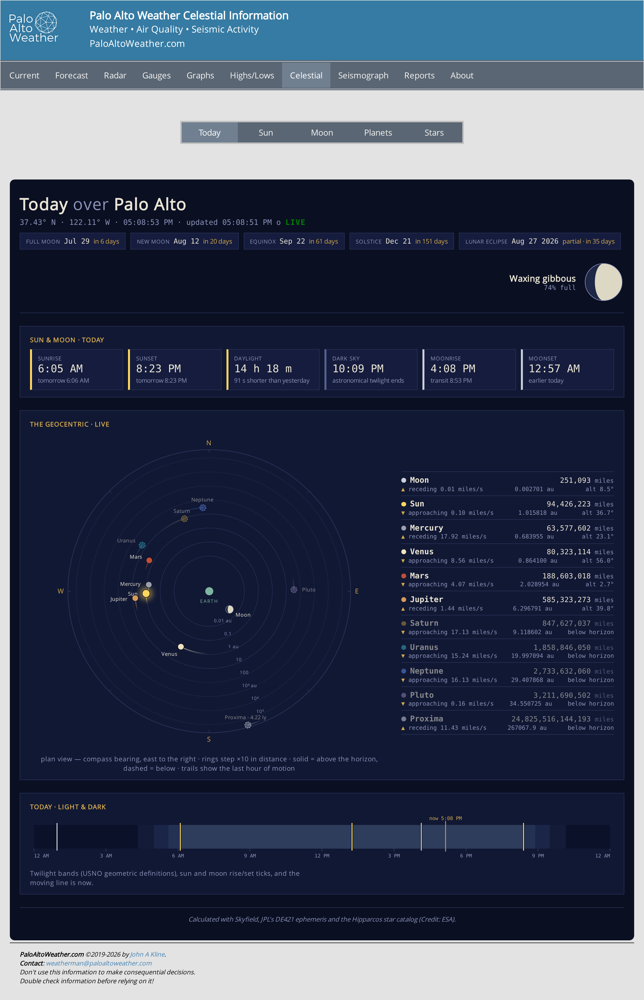
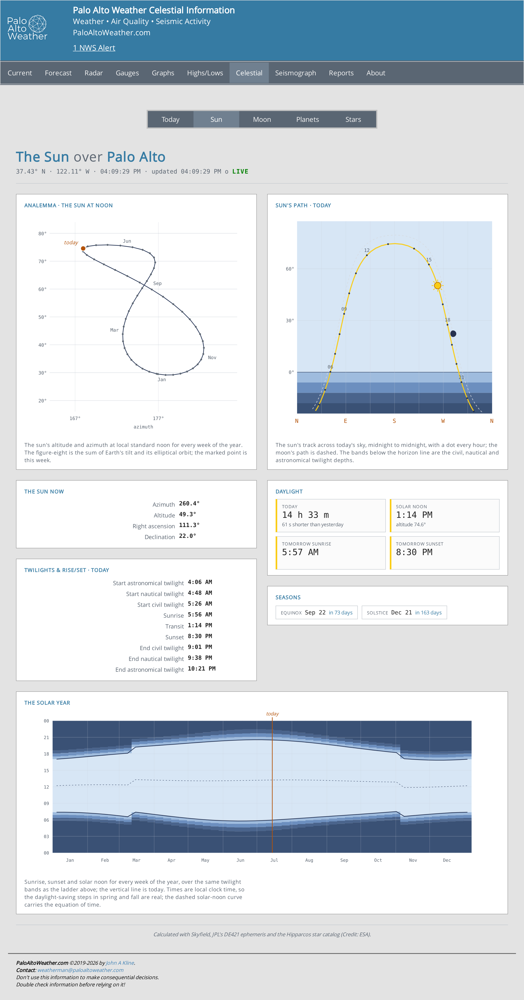
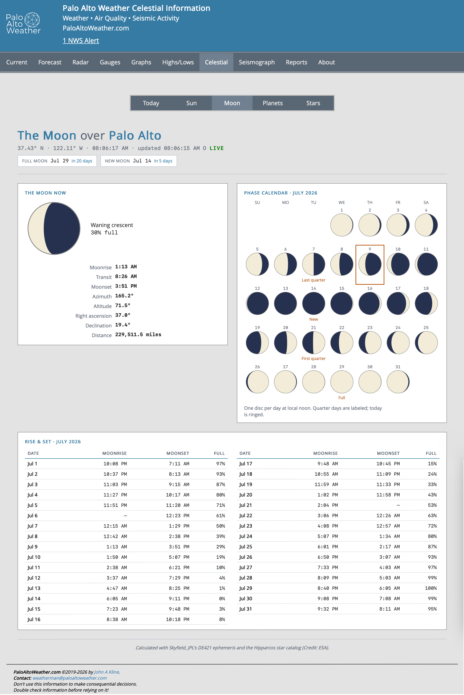
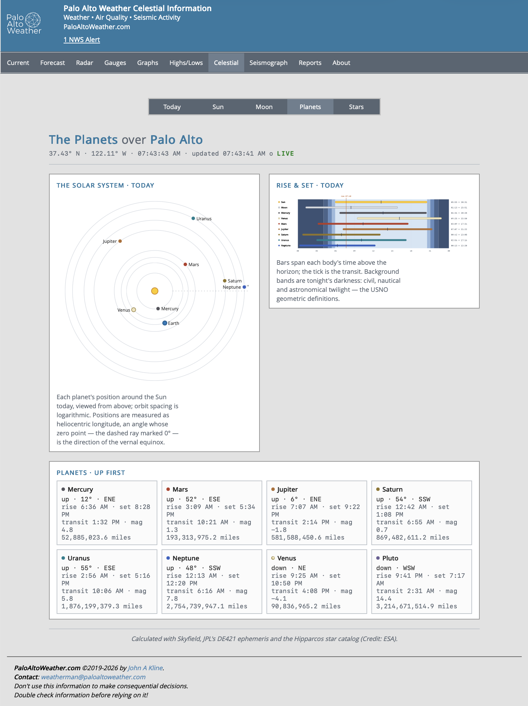
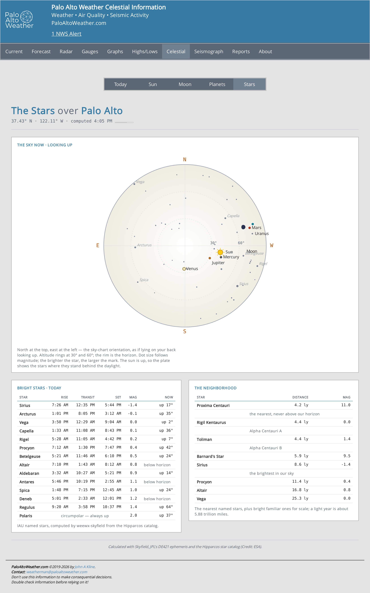

# weewx-celestial
*Open source plugin for WeeWX software.

Copyright (C)2022-2026 by John A Kline (john@johnkline.com)

**This extension requires Python 3.9 or later, WeeWX 4 or 5 and the Skyfield and NumPy libraries.**


## Description

Celestial is a WeeWX service that inserts celestial observations into loop packets.
The information is then available via
[weewx-loopdata plugin](https://github.com/chaunceygardiner/weewx-loopdata), as `current.<celestial-obs>`

As of version 2.0, weewx-celestial uses [Skyfield](https://rhodesmill.org/skyfield/) for *much* more accurate
information than [PyEphem](https://rhodesmill.org/pyephem/index.html), which is currently used by WeeWX.

As of version 4.0, each observation is recomputed only as often as it can change: positions,
distances and the moon's phase on every loop record (about 20 ms on a Raspberry Pi 5); rise/set,
twilight and daylight times once per local day; and the next equinox/solstice/full/new moon only
when one passes.  Every loop record still carries every field.  (Versions 2.3 through 3.x instead
recomputed everything on a ten-second cycle, because a full recompute was too expensive to run
per record.)

As of version 4.2 the bundled JPL DE421 ephemeris is read fully into memory at startup (about
16 MB), so upgrading this extension over a running WeeWX cannot disturb — or crash — the running
service; the new files take effect on the restart that follows the install.

Versions 3.x of weewx-celestial also replaced WeeWX's built-in almanac for report generation.
As of version 4.0 it no longer does: that job now belongs to the independent
[weewx-skyfield](https://github.com/chaunceygardiner/weewx-skyfield) extension (same author),
whose almanac engine grew out of this extension's.

### Report tags: install weewx-skyfield

weewx-celestial does not touch report generation; report tags such as `$almanac.sunrise` are
served by whatever almanac WeeWX has.  For report tags computed with Skyfield — from the same
definitions as these loop fields, plus much more (planet magnitudes and angular sizes, named-star
tags such as `$almanac.rigel.rise`, any Hipparcos star via `$almanac.hip_57939`, heliocentric
coordinates, librations, and so on) — install
[weewx-skyfield](https://github.com/chaunceygardiner/weewx-skyfield).  The two extensions are
designed to run side by side and need no configuration to coexist.

Without weewx-skyfield, reports fall back to WeeWX's built-in PyEphem/weeutil almanac.  The
bundled sample report works either way: cells a capable almanac can fill are rendered at report
generation time, and javascript fills and updates every cell live from loop data regardless.

The information available in loop recordsis based on WeeWX's Seasons Report (Copyright Tom Keffer
and Matthew Wall).  More fields are provided than in the Seasons report, including start/end times
for astronomical and nautical twilight.  Also, distances from earth to the other planets (and Pluto);
as well as the current distance to the moon and sun.

As of version 4.0, the sample report is a live "night-palette" page: a true-phase moon disc, a
day strip showing the twilight bands with rise/set ticks and a pulsing "now" line that moves in
real time, countdown chips for the next full/new moon and equinox/solstice, planets-now chips
(up/down, altitude, compass direction, distance, one identity color per body), and the full data
cards — all updated by javascript from the loop-data.txt file on every loop record (for the
Vantage driver, that happens every 2 seconds).  The data cells are additionally computed at
report generation time when a capable almanac is available (weewx-skyfield, or WeeWX's built-in
PyEphem almanac) so the page first-paints populated; without an extended almanac the page still
generates and the javascript fills everything in.  The new visual components require the 4.0
loop fields in the `[LoopData]` fields list; without them the page works and those components
simply stay empty.  **You do not need to edit the fields list by hand** — a bundled utility
updates it in one command (see the Upgrade Instructions below).

The bundled sample report (Palo Alto, a July evening at 9:12 PM — first-quarter moon in the
west, the brass now-line in the dusk gradient):


The following observations are available in the LOOP packet (names as of version 3.0):

- `astronomicalTwilightEnd`
- `astronomicalTwilightStart`
- `civilTwilightEnd`
- `civilTwilightStart`
- `daylightDur`
- `earthJupiterDistance`
- `earthMarsDistance`
- `earthMercuryDistance`
- `earthNeptuneDistance`
- `earthMoonDistance`
- `earthPlutoDistance`
- `earthProximaCentauriDistance` (light years in every unit system; needs the star catalog, i.e., `stars = true`)
- `earthSaturnDistance`
- `earthSunDistance`
- `earthUranusDistance`
- `earthVenusDistance`
- `jupiterAltitude`
- `jupiterAzimuth`
- `marsAltitude`
- `marsAzimuth`
- `mercuryAltitude`
- `mercuryAzimuth`
- `moonAltitude`
- `moonAzimuth`
- `moonDeclination`
- `moonFullness`
- `moonPhase`
- `moonPhaseIndex` (index into the moon-phases list: 0 = new .. 4 = full .. 7 = waning crescent)
- `moonRightAscension`
- `moonrise`
- `moonset`
- `moonTransit`
- `moonWaxing` (1 while the moon is waxing, else 0)
- `nauticalTwilightEnd`
- `nauticalTwilightStart`
- `neptuneAltitude`
- `neptuneAzimuth`
- `nextEquinox`
- `nextFullMoon`
- `nextNewMoon`
- `nextSolstice`
- `plutoAltitude`
- `plutoAzimuth`
- `saturnAltitude`
- `saturnAzimuth`
- `sunAltitude`
- `sunAzimuth`
- `sunDeclination`
- `sunRightAscension`
- `sunrise`
- `sunset`
- `sunTransit`
- `tomorrowSunrise`
- `tomorrowSunset`
- `uranusAltitude`
- `uranusAzimuth`
- `venusAltitude`
- `venusAzimuth`
- `yesterdayDaylightDur`

### weewx-celestial in Action

The following pages on [www.paloaltoweather.com](https://www.paloaltoweather.com/celestial.html) demonstrate what can be
accomplished with this extension and the [weewx-skyfield extension](https://github.com/chaunceygardiner/weewx-skyfield).







### Deprecated loop field names

The loop fields were renamed in version 3.0 to follow WeeWX's lowerCamelCase convention for
observation names (e.g., `outTemp`, `windSpeed`).  In addition, `daySunshineDur` and
`yesterdaySunshineDur` were renamed to `daylightDur` and `yesterdayDaylightDur`, because they
measure the time the sun is above the horizon (daylight), not "sunshine duration" in the
meteorological sense of measured bright sunshine.

In 3.x releases, every value was written to the loop packet under both its new name and its
old (pre-3.0) name.  **As of version 4.0, the old names are no longer emitted** — your
`weewx.conf` and any custom skins must use the new names.  **There is no need to edit
`weewx.conf` by hand**: the bundled `--migrate-loopdata-fields` utility renames every
deprecated field in your `[LoopData]` fields line automatically (see the Upgrade Instructions
below).  The table that follows is the reference for updating custom skins and javascript,
which the utility cannot see:

| Deprecated (removed in 4.0) | Use instead |
|---|---|
| `AstronomicalTwilightEnd` / `AstronomicalTwilightStart` | `astronomicalTwilightEnd` / `astronomicalTwilightStart` |
| `CivilTwilightEnd` / `CivilTwilightStart` | `civilTwilightEnd` / `civilTwilightStart` |
| `daySunshineDur` | `daylightDur` |
| `EarthJupiterDistance` … `EarthVenusDistance` (all ten) | `earthJupiterDistance` … `earthVenusDistance` |
| `MoonAltitude`, `MoonAzimuth`, `MoonDeclination` | `moonAltitude`, `moonAzimuth`, `moonDeclination` |
| `MoonFullness`, `MoonPhase`, `MoonRightAscension` | `moonFullness`, `moonPhase`, `moonRightAscension` |
| `Moonrise`, `Moonset`, `MoonTransit` | `moonrise`, `moonset`, `moonTransit` |
| `NauticalTwilightEnd` / `NauticalTwilightStart` | `nauticalTwilightEnd` / `nauticalTwilightStart` |
| `NextEquinox`, `NextFullMoon`, `NextNewMoon`, `NextSolstice` | `nextEquinox`, `nextFullMoon`, `nextNewMoon`, `nextSolstice` |
| `SunAltitude`, `SunAzimuth`, `SunDeclination`, `SunRightAscension` | `sunAltitude`, `sunAzimuth`, `sunDeclination`, `sunRightAscension` |
| `Sunrise`, `Sunset`, `SunTransit` | `sunrise`, `sunset`, `sunTransit` |
| `yesterdaySunshineDur` | `yesterdayDaylightDur` |

(`tomorrowSunrise` and `tomorrowSunset` were already lowerCamelCase and are unchanged.)

# Upgrade Instructions

1. If you re upgrading from a previous version to 1.x, and you are using the sample skin, you'll need to add the following
   two fields to the `fields` line in `weewx.conf`:
   `current.tomorrowSunrise.raw, current.tomorrowSunset.raw`

1. If you are upgrading from 1.x versioun, you'll need to install skyfield.  See the install instructions above for how to install skyfield.

1. If you are upgrading from 2.0 to a later version, you'll need to add the following fields in the `fields` line in `weewx.conf`:
   `current.MoonTransit`
   `current.Moonrise`
   `current.Moonset`

1. As of version 4.0, fields are cached by how often they can change (see the Description above), which makes per-record updates cheap:
   `update_rate_secs` now throttles only the continuously varying fields (positions, distances, moon phase) and the installed default is
   `0` (update on every loop record).  If your weewx.conf still has `update_rate_secs = 10` from an earlier release, it keeps working;
   change it to `0` for live updates on every loop record.

1. As of version 4.0, weewx-celestial no longer replaces the almanac used in report generation (versions 3.x did).  If your reports rely
   on Skyfield-computed `$almanac` tags (including named-star tags such as `$almanac.rigel.rise`), install the
   [weewx-skyfield](https://github.com/chaunceygardiner/weewx-skyfield) extension.  The `replace_builtin_almanac` option is gone; a
   leftover setting in the `[Celestial]` section of `weewx.conf` is ignored harmlessly.

1. As of version 4.0, the deprecated pre-3.0 loop field names are no longer emitted (see "Deprecated loop field names" above), and there
   are new loop fields — `moonPhaseIndex`, `moonWaxing` and azimuth/altitude for all eight planets — feeding the redesigned live sample
   report (moon disc, countdown chips, day strip, planets-now chips).  **A bundled utility updates your `[LoopData] [[Include]]
   [[[fields]]]` line for both changes at once**: it renames the deprecated celestial fields in place (keeping their rendition suffixes
   and the line's order), drops the duplicates the renames create, appends the fields the new sample report reads, and never touches
   non-celestial fields.  Run it after installing 4.0:

   `PYTHONPATH=/home/weewx/bin python -m user.celestial --migrate-loopdata-fields --config /home/weewx/weewx.conf --output /home/weewx/weewx.conf.migrated`

   Compare the two files (`diff /home/weewx/weewx.conf /home/weewx/weewx.conf.migrated`), then move the migrated file into place and
   restart WeeWX.  Alternatives: `--in-place` rewrites `weewx.conf` directly (a `.bak-celestial-4.0` backup is made first), and
   `--print-fields-value` just prints the migrated value as a bare comma-separated list for manual pasting (do not add brackets or
   quotes).  The utility is safe to re-run; a second pass changes nothing.

   One caveat: `daySunshineDur`/`yesterdaySunshineDur` are renamed to `daylightDur`/`yesterdayDaylightDur`.  If another extension
   (e.g., weewx-sunduration) provides a *real* `daySunshineDur` on your system, restore those entries by hand — the utility calls
   this out in its summary when it happens.

   Also update any custom skins or JavaScript that read the old names from loop-data.txt (the bundled Celestial sample skin already
   uses the new names as of 3.0).  Without the new fields the page still works and the new visual components simply stay empty.  Displayed times now use the station's timezone, auto-detected at report
   generation time (previously the javascript hardcoded America/Los_Angeles); a new `time_zone` Extras option can override (an IANA
   name, or `browser` for the viewer's browser-local timezone).  The `refresh_rate` Extras option (seconds between loop-data polls) is
   now honored; it existed before but was ignored.

1. As of version 3.0, the bundled JPL ephemeris is named `celestial_de421.bsp` (formerly `de421.bsp`).  `weectl` does not remove
   files dropped from an extension's file list when upgrading, so after upgrading from 2.x, delete the orphaned 17 MB file:
   `sudo rm <weewx-root>/bin/user/de421.bsp`

1. As of version 3.0, there is a new loop field `earthProximaCentauriDistance`, reported in light years in every unit system
   (at 4.22 light years, miles and kilometers are unreadable).  It is only emitted when the star catalog is enabled
   (`stars = true`, the default).  To use it (the bundled Celestial sample skin displays it), add
   `current.earthProximaCentauriDistance.raw` to the `[LoopData] [[Include]] [[[fields]]]` line in `weewx.conf`.

1. As of version 3.0, the right ascension/declination loop fields (`sunRightAscension`, `sunDeclination`, `moonRightAscension`,
   `moonDeclination`, and their deprecated equivalents) are expressed in coordinates of date rather than J2000 (in 2025, right
   ascensions shift by roughly 0.4&deg; as a result).  Apparent coordinates of date are the accepted convention for observed
   positions (they are what the Astronomical Almanac publishes); this also matches PyEphem and the report almanac's
   `topo_ra`/`topo_dec`.


# Installation Instructions

## WeeWX 5 Installation Instructions

1. If pip install,
   Activate the virtual environment (actual syntax varies by type of WeeWX install):
   `/home/weewx/weewx-venv/bin/activate`
   Install the prerequisite skyfield package.
   `pip install skyfield`

1. If package install:
   Install the prerequisite skyfield package.  On debian, that can be accomplished with:
   `sudo apt install python3-skyfield` 

1. Install the latest release of weewx-loopdata at

   [weewx-loopdata GitHub repository](https://github.com/chaunceygardiner/weewx-loopdata).

1. Download the lastest release, weewx-celestial.zip, from

   [weewx-celestial GitHub Repository](https://github.com/chaunceygardiner/weewx-celestial).

1. Install the celestial extension.

   `weectl extension install weewx-celestial.zip`

1. Add the following fields to the `[LoopData][[Include]][[[fields]]]` line in `weewx.conf`.  (They are used by the sample report.)

   `current.astronomicalTwilightEnd.raw, current.astronomicalTwilightStart.raw, current.civilTwilightEnd.raw, current.civilTwilightStart.raw, current.dateTime.raw, current.daylightDur.raw, current.earthJupiterDistance, current.earthMarsDistance, current.earthMercuryDistance, current.earthMoonDistance, current.earthNeptuneDistance, current.earthPlutoDistance, current.earthProximaCentauriDistance.raw, current.earthSaturnDistance, current.earthSunDistance, current.earthUranusDistance, current.earthVenusDistance, current.jupiterAltitude.raw, current.jupiterAzimuth.raw, current.marsAltitude.raw, current.marsAzimuth.raw, current.mercuryAltitude.raw, current.mercuryAzimuth.raw, current.moonAltitude.raw, current.moonAzimuth.raw, current.moonDeclination.raw, current.moonFullness, current.moonFullness.raw, current.moonPhase, current.moonPhaseIndex.raw, current.moonRightAscension.raw, current.moonTransit, current.moonTransit.raw, current.moonWaxing.raw, current.moonrise, current.moonrise.raw, current.moonset, current.moonset.raw, current.nauticalTwilightEnd.raw, current.nauticalTwilightStart.raw, current.neptuneAltitude.raw, current.neptuneAzimuth.raw, current.nextEquinox, current.nextEquinox.raw, current.nextFullMoon, current.nextFullMoon.raw, current.nextNewMoon, current.nextNewMoon.raw, current.nextSolstice, current.nextSolstice.raw, current.plutoAltitude.raw, current.plutoAzimuth.raw, current.saturnAltitude.raw, current.saturnAzimuth.raw, current.sunAltitude.raw, current.sunAzimuth.raw, current.sunDeclination.raw, current.sunRightAscension.raw, current.sunTransit.raw, current.sunrise.raw, current.sunset.raw, current.tomorrowSunrise.raw, current.tomorrowSunset.raw, current.uranusAltitude.raw, current.uranusAzimuth.raw, current.venusAltitude.raw, current.venusAzimuth.raw, current.yesterdayDaylightDur.raw`

1. Restart WeeWX.

1. After a reporting cycle runs, check navigate to `<weewx-url>/celestial/ in your browser
   to see the default celestial sample report. (Reports typcially run every 5 minutes.)

## WeeWX 4 Installation Instructions

1. Install the prerequisite skyfield package.  On debian, that can be accomplished with:
   `sudo apt install python3-skyfield` 

1. Install the latest release of weewx-loopdata at

   [weewx-loopdata GitHub repository](https://github.com/chaunceygardiner/weewx-loopdata).

1. Add the following fields to the `[LoopData][[Include]][[[fields]]]` line in `weewx.conf`.  (They are used by the sample report.)

   `current.astronomicalTwilightEnd.raw, current.astronomicalTwilightStart.raw, current.civilTwilightEnd.raw, current.civilTwilightStart.raw, current.dateTime.raw, current.daylightDur.raw, current.earthJupiterDistance, current.earthMarsDistance, current.earthMercuryDistance, current.earthMoonDistance, current.earthNeptuneDistance, current.earthPlutoDistance, current.earthProximaCentauriDistance.raw, current.earthSaturnDistance, current.earthSunDistance, current.earthUranusDistance, current.earthVenusDistance, current.jupiterAltitude.raw, current.jupiterAzimuth.raw, current.marsAltitude.raw, current.marsAzimuth.raw, current.mercuryAltitude.raw, current.mercuryAzimuth.raw, current.moonAltitude.raw, current.moonAzimuth.raw, current.moonDeclination.raw, current.moonFullness, current.moonFullness.raw, current.moonPhase, current.moonPhaseIndex.raw, current.moonRightAscension.raw, current.moonTransit, current.moonTransit.raw, current.moonWaxing.raw, current.moonrise, current.moonrise.raw, current.moonset, current.moonset.raw, current.nauticalTwilightEnd.raw, current.nauticalTwilightStart.raw, current.neptuneAltitude.raw, current.neptuneAzimuth.raw, current.nextEquinox, current.nextEquinox.raw, current.nextFullMoon, current.nextFullMoon.raw, current.nextNewMoon, current.nextNewMoon.raw, current.nextSolstice, current.nextSolstice.raw, current.plutoAltitude.raw, current.plutoAzimuth.raw, current.saturnAltitude.raw, current.saturnAzimuth.raw, current.sunAltitude.raw, current.sunAzimuth.raw, current.sunDeclination.raw, current.sunRightAscension.raw, current.sunTransit.raw, current.sunrise.raw, current.sunset.raw, current.tomorrowSunrise.raw, current.tomorrowSunset.raw, current.uranusAltitude.raw, current.uranusAzimuth.raw, current.venusAltitude.raw, current.venusAzimuth.raw, current.yesterdayDaylightDur.raw`

1. Download the lastest release, weewx-celestial.zip, from

   [weewx-celestial GitHub Repository](https://github.com/chaunceygardiner/weewx-celestial).

1. Run the following command.

   `sudo /home/weewx/bin/wee_extension --install weewx-celestial.zip`

   Note: this command assumes weewx is installed in /home/weewx.  If it's installed
   elsewhere, adjust the path of wee_extension accordingly.

1. Restart WeeWX.

1. After a reporting cycle runs, check navigate to `<weewx-url>/celestial/ in your browser
   to see the default celestial sample report. (Reports typcially run every 5 minutes.)

## Entries in `Celestial` section of `weewx.conf`:

```
[Celestial]
    enable = true
    update_rate_secs = 0
    stars = true
```

 * `enable`          : When true, the celestial observations are added to every loop record.
 * `update_rate_secs`: number of seconds that have to pass before the continuously varying fields
                       (positions, distances, moon phase) are recalculated; `0` (the default)
                       recalculates them on every loop record.  The daily and next-event fields
                       have their own natural lifetimes and are unaffected by this setting.
 * `stars`           : When true (the default), the `earthProximaCentauriDistance` loop field is emitted,
                       computed from the bundled Hipparcos catalog excerpt (`celestial_stars.dat`).

## Entries in `CelestialReport` section of `weewx.conf`:

```
    [[CelestialReport]]
        HTML_ROOT = public_html/celestial
        enable = true
        skin = Celestial
        [[[Extras]]]
            loop_data_file = ../loop-data.txt
            refresh_rate = 2
            expiration_time = 24
            page_update_pwd = foobar
```

 * HTML_ROOT        : The HTML output directory in which to write the report.
 * `enable`         : When true, the report is generated.
 * `skin`           : Must be `Celestial`
 * `loop_data_file` : The path of the loop-dat.txt file (written by the loopdata extension).
                      If a relative path is specified, it is relative to the
                     `target_report` directory.
 * `refresh_rate`   : Seconds between loop-data polls.  Match weewx-loopdata's write cadence
                      (2 seconds for the Vantage driver).
 * `time_zone`      : Timezone for every time shown on the page (rise/set cells, day strip,
                      clock).  By default the station's timezone is auto-detected at report
                      generation time, so remote viewers of a public page see station time —
                      no setting needed.  Set only to override: an IANA name (e.g.,
                      `America/New_York`) forces that zone; `browser` forces the viewer's
                      browser-local timezone.
 * `expiration_time`: The number of hours before expiring the autoupdate of the report.
 * `page_update_pwd`: The password to specify in the URL such that the page never expires.
                      That is, `<machine>/weewx/celestial/?pageUpdate=foobar`

## Testing

### Automated tests

A pytest test suite lives in the `tests` directory.  It exercises the loop fields and their
Sky engine (rise/set/transit and twilight times, equinoxes/solstices, moon phases, positions,
distances and their units, polar day/night edge cases, the sample skin's end-to-end render,
and pinned regression values for Palo Alto on 2025-06-21).  When the
[weewx-skyfield](https://github.com/chaunceygardiner/weewx-skyfield) extension is available
(installed on the machine, or checked out as a sibling repository), the loop fields are also
cross-checked against its report almanac: the two extensions compute from the same definitions,
so their values must agree.  Run the suite from the root of this repository with the Python
from your WeeWX virtual environment (WeeWX, Skyfield and pytest must be installed in that
environment):

```
/home/weewx/weewx-venv/bin/python -m pytest tests
```

The star tests use the bundled Hipparcos catalog excerpt (`bin/user/celestial_stars.dat`),
which is part of this repository, so no additional downloads are needed.

### Command line check

Celestial can be run from the command line to verify the readings.  Below are examples.  Use --help for all of the options.
`PYTHON_PATH` needs to point to the user directory for weewx.  That is, it needs to point to where extensions are located.

1. `/home/weewx/weewx-venv/bin/activate`
2. `PYTHONPATH=/home/weewx/bin python -m user.celestial --test --out-temp=65.1 --barometer=30.128` (for inputs in US units)
   `PYTHONPATH=/home/weewx/bin python -m user.celestial --test --out-temp=18.4 --barometer=1020.25 --metric` (for temp and barometer in Metric units)

Example output from above test execution:
```
Skyfield version: 1.54.
                moonPhase:                      Waning gibbous
     earthJupiterDistance:                 580,002,076.2 miles
        earthMarsDistance:                 194,417,412.8 miles
     earthMercuryDistance:                  53,857,884.8 miles
     earthNeptuneDistance:               2,760,433,627.2 miles
        earthMoonDistance:                     241,090.0 miles
       earthPlutoDistance:               3,216,323,226.6 miles
      earthSaturnDistance:                 875,208,906.9 miles
         earthSunDistance:                  94,502,823.0 miles
      earthUranusDistance:               1,880,091,466.7 miles
       earthVenusDistance:                  93,494,330.4 miles
              daylightDur: 14 hours, 39 minutes and 13 seconds
     yesterdayDaylightDur: 14 hours, 39 minutes and 57 seconds
             moonFullness:                            70% full
             moonAltitude:                              -37.2°
              moonAzimuth:                              300.5°
          moonDeclination:                               -2.7°
       moonRightAscension:                              350.1°
              sunAltitude:                               66.3°
               sunAzimuth:                              237.8°
           sunDeclination:                               22.7°
        sunRightAscension:                              105.1°
  astronomicalTwilightEnd:           July 05, 2026 at 10:24 PM
astronomicalTwilightStart:           July 05, 2026 at 04:01 AM
         civilTwilightEnd:           July 05, 2026 at 09:03 PM
       civilTwilightStart:           July 05, 2026 at 05:22 AM
                 moonrise:           July 05, 2026 at 11:51 PM
                  moonset:           July 05, 2026 at 11:20 AM
              moonTransit:           July 05, 2026 at 05:19 AM
      nauticalTwilightEnd:           July 05, 2026 at 09:41 PM
    nauticalTwilightStart:           July 05, 2026 at 04:44 AM
              nextEquinox:      September 22, 2026 at 05:05 PM
             nextFullMoon:           July 29, 2026 at 07:35 AM
              nextNewMoon:           July 14, 2026 at 02:43 AM
             nextSolstice:       December 21, 2026 at 12:50 PM
                  sunrise:           July 05, 2026 at 05:53 AM
                   sunset:           July 05, 2026 at 08:32 PM
               sunTransit:           July 05, 2026 at 01:13 PM
          tomorrowSunrise:           July 06, 2026 at 05:53 AM
           tomorrowSunset:           July 06, 2026 at 08:32 PM
All fields present and of the correct type.  The test passed.
```


## Why require Python 3.9 or later?

Celestial code uses timezone aware date features which do not work with Python 2, nor in
versions of Python 3 earlier than 3.9.


## Licensing

weewx-celestial is licensed under the GNU Public License v3.

The bundled star catalog excerpt (`celestial_stars.dat`) contains data from the Hipparcos and
Tycho Catalogues, which ESA distributes under the
[CC BY-NC 3.0 IGO](https://creativecommons.org/licenses/by-nc/3.0/igo/) licence.  Credit: ESA.
