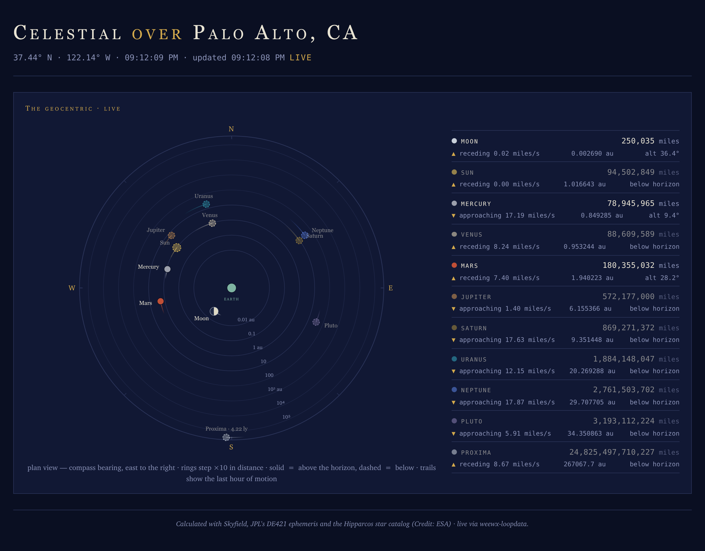

# weewx-celestial
Open source plugin for WeeWX software.

Copyright (C)2022-2026 by John A Kline (john@johnkline.com)

**This extension requires Python 3.9 or later, WeeWX 5.2 or later,
[weewx-loopdata](https://github.com/chaunceygardiner/weewx-loopdata) 5.0 or
later, and (strongly recommended)
[weewx-skyfield](https://github.com/chaunceygardiner/weewx-skyfield).**

## Description

weewx-celestial ships a live celestial page (the bundled `Celestial` skin):
sun and moon rise/set/transit, the twilight ladder, a true-phase moon disc,
a light-and-dark day strip with a pulsing now-line, countdown chips to the
next full/new moon, equinox, solstice and eclipse, planets-now chips
(up/down, altitude, compass direction, distance), the full data cards, and
seven server-rendered sky charts (sky dome, rise/set timeline, orrery,
analemma, sun path, solar year, lunar month) drawn by weewx-skyfield.
Every live value updates from `loop-data.txt` on every loop record (for the
Vantage driver, every 2 seconds).

The bundled sample report (Palo Alto, a July evening at 9:12 PM — first-quarter moon in the
west, the brass now-line in the dusk gradient, and the seven weewx-skyfield sky charts):


As of 6.0, the live values are **weewx-loopdata almanac fields**: report
almanac tags (computed by weewx-skyfield's almanac) that weewx-loopdata
evaluates on every loop packet and publishes in `loop-data.txt`, converted
and formatted exactly as the report tags render.  One computation engine
serves the report tags and the live page, so they always agree.  This
extension therefore no longer runs a service, computes nothing itself, and
inserts nothing into loop packets — versions through 5.x did; see the
upgrade instructions below for the (mechanically assisted) migration.

What installs:

- The `Celestial` skin (the sample report), registered as `CelestialReport`.
- The `CelestialSkyPage` search list, which serves weewx-skyfield's
  `$sky_page` charts to the skin — and install hints instead when
  weewx-skyfield is absent, never a failed report.
- The `--migrate-loopdata-fields` command-line utility (see upgrading).

The page renders first-paint values at report time from `$almanac` and then
keeps every cell live from loop data.  What you see depends on the almanac
WeeWX has: with **weewx-skyfield**, everything.  With **PyEphem** (no
weewx-skyfield), the live page is complete except the Proxima Centauri row,
while the seven sky-chart panels show install hints and the
eclipse/constellation cells are omitted.  With only WeeWX's **built-in
almanac**, the page still generates and runs, but live data reduces to
sunrise/sunset (today and tomorrow) and the moon phase name — 5.x computed
everything itself; 6.0 delegates that to the almanac, which is why
weewx-skyfield is strongly recommended.

# Installation Instructions

1. Install [weewx-loopdata](https://github.com/chaunceygardiner/weewx-loopdata)
   5.0 or later and
   [weewx-skyfield](https://github.com/chaunceygardiner/weewx-skyfield),
   both per their instructions.

1. Download `weewx-celestial.zip` from the release page, then:

   ```
   weectl extension install weewx-celestial.zip
   ```

1. Add the fields the report reads to the `fields` line of
   `[LoopData] [[Include]]` in `weewx.conf`.  The line must stay a BARE
   comma-separated list (no brackets or quotes).  Append:

   ```
   current.dateTime.raw, almanac.sunrise.raw, almanac.sunset.raw, almanac.sun.transit.raw, almanac(days=1).sunrise.raw, almanac(days=1).sunset.raw, almanac.sun.visible.raw, almanac(days=-1).sun.visible.raw, almanac(horizon=-6).sun(use_center=1).rise.raw, almanac(horizon=-6).sun(use_center=1).set.raw, almanac(horizon=-12).sun(use_center=1).rise.raw, almanac(horizon=-12).sun(use_center=1).set.raw, almanac(horizon=-18).sun(use_center=1).rise.raw, almanac(horizon=-18).sun(use_center=1).set.raw, almanac.sun.az, almanac.sun.alt, almanac.sun.ra, almanac.sun.dec, almanac.moon.rise.raw, almanac.moon.transit.raw, almanac.moon.set.raw, almanac.moon.az, almanac.moon.alt, almanac.moon.ra, almanac.moon.dec, almanac.moon_phase, almanac.moon_index, almanac.moon.phase, almanac.next_equinox.raw, almanac.next_solstice.raw, almanac.next_full_moon.raw, almanac.next_new_moon.raw, almanac.sun.earth_distance, almanac.moon.earth_distance, almanac.mercury.az, almanac.mercury.alt, almanac.mercury.earth_distance, almanac.venus.az, almanac.venus.alt, almanac.venus.earth_distance, almanac.mars.az, almanac.mars.alt, almanac.mars.earth_distance, almanac.jupiter.az, almanac.jupiter.alt, almanac.jupiter.earth_distance, almanac.saturn.az, almanac.saturn.alt, almanac.saturn.earth_distance, almanac.uranus.az, almanac.uranus.alt, almanac.uranus.earth_distance, almanac.neptune.az, almanac.neptune.alt, almanac.neptune.earth_distance, almanac.pluto.az, almanac.pluto.alt, almanac.pluto.earth_distance, almanac.proxima_centauri.earth_distance
   ```

   (Entries already present — e.g. `current.dateTime.raw` — need not be
   repeated; weewx-loopdata ignores duplicates.)

1. Restart WeeWX.  The report appears under `celestial/` of your web root.

# Upgrade Instructions (from 5.x or earlier)

6.0 removed this extension's loop fields (`current.sunrise`,
`current.earthMarsDistance`, `current.moonWaxing`, …); the almanac fields
above replace them.  The sequence matters — the migration utility ships
with 6.0, so 6.0 must be installed before it can run:

1. **Uninstall the old version** (recommended):

   ```
   weectl extension uninstall celestial
   ```

   `weectl extension install` over an existing version only overlays files;
   it never reverses what the old version registered.  Uninstalling first
   (while the old install record still exists) removes the old service
   registration and the bundled `celestial_de421.bsp`/`celestial_stars.dat`
   files.  If you skip this and install over the top, nothing breaks — 6.0
   ships a stub `Celestial` service that logs a warning and exits,
   precisely so a leftover `user.celestial.Celestial` in `data_services`
   cannot keep weewxd from starting — but finish the cleanup by hand:
   delete `user.celestial.Celestial` from `data_services` in
   `[Engine] [[Services]]` (that silences the warning) and remove the two
   orphaned `celestial_*` data files from `bin/user`.

1. Install [weewx-loopdata](https://github.com/chaunceygardiner/weewx-loopdata)
   5.0+ and [weewx-skyfield](https://github.com/chaunceygardiner/weewx-skyfield)
   if you have not already, then install 6.0:

   ```
   weectl extension install weewx-celestial.zip
   ```

1. Run the bundled utility to rewrite your `[LoopData] [[Include]] fields`
   line — every celestial entry (including pre-3.0 PascalCase names)
   becomes its almanac equivalent, rendition suffixes are honored,
   non-celestial entries are never touched, and the fields the 6.0 report
   needs are appended:

   ```
   source /home/weewx/weewx-venv/bin/activate
   cd /home/weewx/bin    # the directory CONTAINING the `user` package
                         # (~/weewx-data/bin on pip installs)
   python -m user.celestial --migrate-loopdata-fields --config /home/weewx/weewx.conf --output /tmp/weewx.conf.migrated
   diff /home/weewx/weewx.conf /tmp/weewx.conf.migrated   # review, then move into place
   ```

   (`--in-place` edits weewx.conf directly after making a
   `.bak-celestial-6.0` backup; `--print-fields-value` just prints the
   migrated line for cut-and-paste.)

1. Restart WeeWX.

If your own pages read the old fields, note the three changes with no
1:1 equivalent:

- **Distances arrive as raw astronomical units** (the value reports show),
  no longer miles/km — convert in the page (× 92,955,807 miles/AU or
  × 149,597,870 km/AU).  Proxima Centauri is AU as well, no longer light
  years (÷ 63,241.077 AU/ly).
- **`almanac.moon.phase`** (the `moonFullness` replacement) is a raw
  percent (e.g. `33.6`), no longer a formatted string.
- **`moonWaxing` is gone**: the moon is waxing exactly when
  `almanac.next_full_moon.raw < almanac.next_new_moon.raw` (the bundled
  skin shows the derivation).

The `[Celestial]` section of weewx.conf (`enable`, `update_rate_secs`,
`stars`) is obsolete and can be deleted.  The Skyfield and NumPy libraries
are no longer required by this extension (weewx-skyfield requires them,
and has its own ephemeris and star catalog).

## Entries in `CelestialReport` section of `weewx.conf`:

```
[StdReport]
    [[CelestialReport]]
        HTML_ROOT = celestial
        enable = true
        skin = Celestial
        [[[Extras]]]
            loop_data_file = ../loop-data.txt
            refresh_rate = 2
            expiration_time = 24
            page_update_pwd = foobar
```

- `loop_data_file`: where the javascript fetches loop data; relative paths
  are relative to this report's HTML_ROOT.
- `refresh_rate`: seconds between loop-data polls (match weewx-loopdata's
  write cadence: 2 for the Vantage driver).
- `expiration_time`: hours the page keeps polling before requiring a click
  (`?pageUpdate=<page_update_pwd>` in the URL disables expiration).
- The skin's `time_zone` Extras option (see `skin.conf`) controls the
  timezone of displayed times; by default the station's zone is
  auto-detected at report time.

## Adding the live celestial panels to your own skin

Everything the sample skin does is ordinary weewx-loopdata consumption:
list the almanac fields you want in `[LoopData] [[Include]] fields`, give
your HTML elements ids equal to the json keys, and poll `loop-data.txt`
from javascript.  `skins/Celestial/realtime_updater.inc` is the reference
implementation — the moon disc, day strip, countdown chips and planet chips
are self-contained functions you can lift, and
`skins/Celestial/celestial.css` holds every color.  The full almanac-field
grammar (any report almanac tag with the `$` removed, plus the
`almanac(days=±N)` tomorrow/yesterday extension) is documented in
[weewx-loopdata's README](https://github.com/chaunceygardiner/weewx-loopdata#almanac-fields).

## See it in action at PaloAltoWeather.com

[PaloAltoWeather.com's celestial pages](https://www.paloaltoweather.com/celestial.html)
are built on the same almanac fields (with their own styling).

## Testing

### Automated tests

```
cd ~/software/weewx-celestial     # your checkout
/home/weewx/weewx-venv/bin/python -m pytest tests
```

The suite renders the bundled skin end to end through Cheetah's
errorCatcher with the weewx-skyfield almanac (skipping those tests when
weewx-skyfield is not importable), exercises the `CelestialSkyPage` shim,
and cross-checks every entry the migration utility can produce against the
weewx-loopdata almanac-field parser (when a weewx-loopdata checkout is
available).

### Command line check

To sanity check an installed configuration, confirm the `almanac.*` keys
appear in `loop-data.txt` after a restart:

```
python3 -c "import json; d=json.load(open('/home/weewx/gauge-data/loop-data.txt')); print(sorted(k for k in d if k.startswith('almanac')))"
```

## Why require Python 3.9 or later?

weewx-celestial is tested on Python 3.9 and later.  WeeWX 5.2 — this
extension's minimum, the first release with extensible almanacs — runs on
older Pythons, but the test matrix here does not.

## Licensing

weewx-celestial is licensed under the GNU Public License v3.
