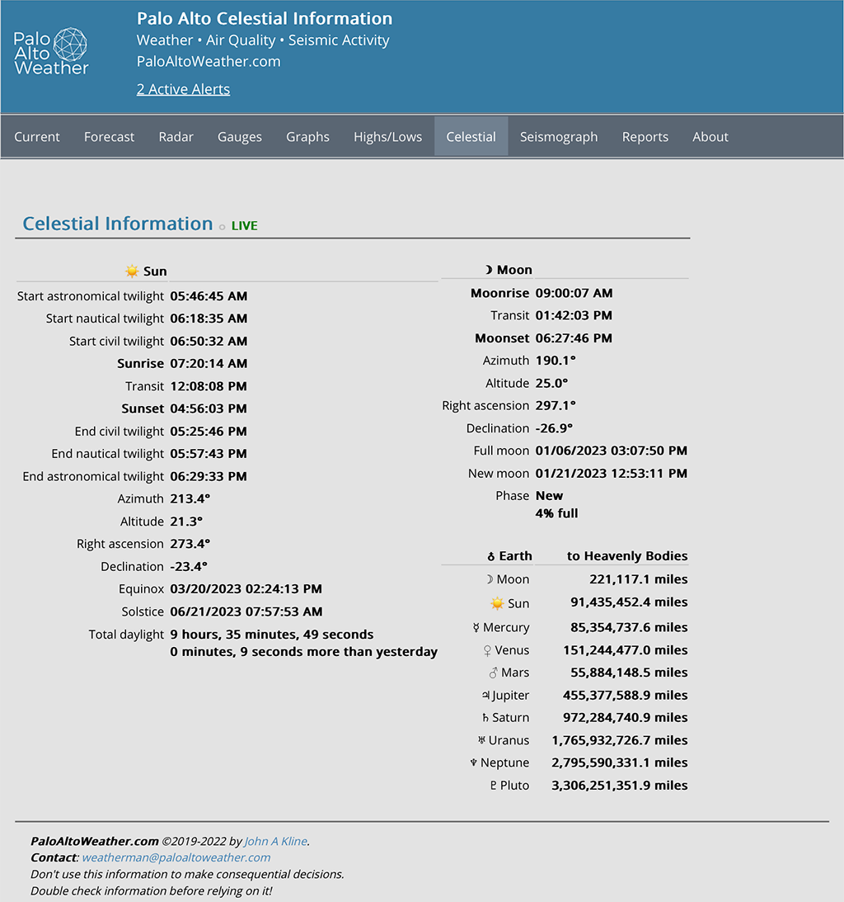

# weewx-celestial
*Open source plugin for WeeWX software.

Copyright (C)2022-2025 by John A Kline (john@johnkline.com)

**This extension requires Python 3.9 or later, WeeWX 4 or 5 and the Skyfield and NumPy libraries.
Replacing the almanac used in report generation requires WeeWX 5.2 or later.**


## Description

Celestial is a WeeWX service that inserts celestial observations into loop packets.
The information is then available via
[weewx-loopdata plugin](https://github.com/chaunceygardiner/weewx-loopdata), as `current.<celestial-obs>`

As of version 2.0, weewx-celestial uses [Skyfield](https://rhodesmill.org/skyfield/) for *much* more accurate
information than [PyEphem](https://rhodesmill.org/pyephem/index.html), which is currently used by WeeWX.

As of version 2.3, celestial observations are only recomputed every ten seconds (by default) rather than
on every loop record.  That is, the observations will be inserted into every loop record, but the observations
will only be updated every ten seconds.

As of version 3.0, weewx-celestial also replaces WeeWX's built-in almanac (PyEphem or weeutil) for
report generation (this requires WeeWX 5.2 or later).  Report tags such as `$almanac.sunrise`,
`$almanac.moon.transit`, `$almanac(horizon=-6).sun(use_center=1).rise` and `$almanac.next_full_moon`
(as used, for example, in the Seasons skin's Celestial page) are computed with Skyfield and JPL's
ephemeris; so generated reports show the same (more accurate) values as the loop packet fields.
To turn this off (i.e., to leave report generation on the built-in almanac), set
`replace_builtin_almanac = false` in the `Celestial` section of `weewx.conf`.

The Skyfield report almanac natively computes, for the sun, the moon and all planets (plus Pluto):
rise/set/transit (including `next_`/`previous_` rising, setting, transit and antitransit), custom
horizons and `use_center` (for twilight tags), azimuth/altitude, right ascension/declination
(topocentric, astrometric and geocentric), heliocentric longitude/latitude, elongation, earth and
sun distance, visible time and its day-over-day change, magnitude (`$almanac.venus.mag`), percent
illuminated (`$almanac.venus.phase`), apparent angular size (`$almanac.sun.size`,
`$almanac.moon.radius_size`), `circumpolar`/`neverup`, parallactic angle and sidereal time; as well
as equinoxes, solstices, moon phases and the moon index.  PyEphem is *not* required for any of
these, nor for any tag used by WeeWX's standard skins.

Named stars (e.g., `$almanac.rigel.rise`, `$almanac.polaris.circumpolar`, `$almanac.sirius.mag`)
are also computed natively.  The names are the official proper names of the IAU Catalog of
Star Names (every entry of the Working Group on Star Names' IAU-CSN list with a Hipparcos
number), plus PyEphem's 115 star names for backward compatibility (a few of those are legacy
spellings of the same stars, e.g. `albereo` for `albireo`) — 420 names in all, covering 412
stars.  Multi-word names use
underscores and diacritics are dropped (`$almanac.kaus_australis.rise`,
`$almanac.barnards_star.mag`).  Any other Hipparcos star can be addressed by catalog number:
`$almanac.hip_57939.rise`.  The star positions, proper motions, parallaxes and magnitudes come
from `celestial_stars.dat`, an excerpt of the Hipparcos Catalogue (The Hipparcos and Tycho
Catalogues, ESA SP-1200, 1997; distributed by CDS as VizieR catalog I/239) which is installed
along with the extension; install a full `hip_main.dat` alongside it to serve all 118,218
Hipparcos stars.  Unlike PyEphem, `earth_distance` and `sun_distance` work for stars (in
astronomical units, like the planets — e.g., `$almanac.proxima_centauri.earth_distance`),
computed from the star's Hipparcos parallax.  Star support can be turned off by setting
`stars = false` in the `Celestial` section of `weewx.conf`.

As of 3.0, everything WeeWX's built-in almanac computes is computed natively, including the
moon's libration and selenographic colongitude, Jupiter's central meridian longitudes and
Saturn's ring tilt (formerly PyEphem fallbacks).  The only things that still fall through to
PyEphem, when it is installed, are named stars when the star catalog is disabled and direct
PyEphem body attributes this extension does not compute (e.g., `$almanac.moon.subsolar_lat`).

### Differences from PyEphem

Where PyEphem and standard astronomical conventions differ, weewx-celestial follows the standard
definitions rather than PyEphem:

- A custom horizon (e.g., `$almanac(horizon=-6)`) is treated as a geometric altitude: no
  atmospheric refraction is applied.  This matches the USNO definitions of civil, nautical and
  astronomical twilight.  (PyEphem applies refraction to a custom horizon unless the `pressure=0`
  idiom is used, which shifts twilight times by roughly 2-3 minutes.)  With the default horizon,
  rise and set include standard refraction (34 arcminutes) and the body's apparent radius, and
  `circumpolar`/`neverup` are judged against that same effective horizon, so they always agree
  with rise/set.
- `hlongitude`/`hlatitude` are true heliocentric (sun-centered) ecliptic coordinates for every
  body, including the moon.  (PyEphem reports the moon's *geocentric* ecliptic longitude under
  this name.)  For the sun itself, heliocentric coordinates are undefined, so Earth's heliocentric
  coordinates are reported, per the XEphem convention.
- The default horizon honors the almanac's `pressure` and `temperature` for rise/set: refraction
  is scaled from the standard 34 arcminutes, and WeeWX's documented `pressure=0` idiom turns it
  off entirely (PyEphem behavior preserved; previously these settings were ignored for rise/set).
- `$almanac.separation()` takes two `(longitude, latitude)` tuples in radians and returns radians,
  per the WeeWX 5.2 almanac API.  It also accepts two of this almanac's own body binders —
  `$almanac.separation($almanac.mars, $almanac.venus)` — computed natively.  Calls made with
  PyEphem `Body` arguments are passed through to PyEphem when it is installed.
- Jupiter's central meridian longitudes (`$almanac.jupiter.cmlI`/`cmlII`) are computed from the
  IAU rotation elements (pole and System I/II rotation rates) and the light-time corrected
  geometry.  PyEphem's values differ from the IAU definition by about 0.8 degrees.
- The moon's libration (`libration_lat`/`libration_long`) and selenographic colongitude
  (`colong`) are the optical libration per Meeus, Astronomical Algorithms ch. 53; the physical
  libration (at most 0.04 degrees) is neglected.  Saturn's ring tilt (`earth_tilt`/`sun_tilt`)
  follows Meeus ch. 45.  All are in radians, like PyEphem's.

The information available in loop records, as well as the sample report provided is based on WeeWX's
Seasons Report (Copyright Tom Keffer and Matthew Wall).  More fields are provided than in the Seasons
report, including start/end times for astronomical and nautical twilight.  Also, distances from earth to
the other planets (and Pluto); as well as the current distance to the moon and sun.

As of 3.0, every value in the sample report is computed at report generation time (when a capable
almanac is available); javascript then keeps the values updated from the loop-data.txt file on
every loop record (for the Vantage driver, that happens every 2 seconds).  Without an extended
almanac, the page still generates with empty cells and the javascript fills them in, as in 2.x.

See weewx-celestial in action with at
[www.paloaltoweather.com/celestial.html](https://www.paloaltoweather.com/celestial.html)
A screen shot is below:


This extension also comes with a sample report.


The following observations are available in the LOOP packet (names as of version 3.0):

- `astronomicalTwilightEnd`
- `astronomicalTwilightStart`
- `civilTwilightEnd`
- `civilTwilightStart`
- `daylightDur`
- `earthJupiterDistance`
- `earthMarsDistance`
- `earthMercuryDistance`
- `earthNeptuneDistance`
- `earthMoonDistance`
- `earthPlutoDistance`
- `earthProximaCentauriDistance` (light years in every unit system; needs the star catalog, i.e., `stars = true`)
- `earthSaturnDistance`
- `earthSunDistance`
- `earthUranusDistance`
- `earthVenusDistance`
- `moonAltitude`
- `moonAzimuth`
- `moonDeclination`
- `moonFullness`
- `moonPhase`
- `moonRightAscension`
- `moonrise`
- `moonset`
- `moonTransit`
- `nauticalTwilightEnd`
- `nauticalTwilightStart`
- `nextEquinox`
- `nextFullMoon`
- `nextNewMoon`
- `nextSolstice`
- `sunAltitude`
- `sunAzimuth`
- `sunDeclination`
- `sunRightAscension`
- `sunrise`
- `sunset`
- `sunTransit`
- `tomorrowSunrise`
- `tomorrowSunset`
- `yesterdayDaylightDur`

### Deprecated loop field names

The loop fields were renamed in version 3.0 to follow WeeWX's lowerCamelCase convention for
observation names (e.g., `outTemp`, `windSpeed`).  In addition, `daySunshineDur` and
`yesterdaySunshineDur` were renamed to `daylightDur` and `yesterdayDaylightDur`, because they
measure the time the sun is above the horizon (daylight), not "sunshine duration" in the
meteorological sense of measured bright sunshine.

**In 3.x releases, every value is written to the loop packet under BOTH its new name and its
old (pre-3.0) name**, so existing `[LoopData]` fields lists and skins keep working unchanged.
**The old names will be REMOVED in version 4.0** — update your `weewx.conf` and any custom skins
to the new names before then.  The old names and their replacements:

| Deprecated (removed in 4.0) | Use instead |
|---|---|
| `AstronomicalTwilightEnd` / `AstronomicalTwilightStart` | `astronomicalTwilightEnd` / `astronomicalTwilightStart` |
| `CivilTwilightEnd` / `CivilTwilightStart` | `civilTwilightEnd` / `civilTwilightStart` |
| `daySunshineDur` | `daylightDur` |
| `EarthJupiterDistance` … `EarthVenusDistance` (all ten) | `earthJupiterDistance` … `earthVenusDistance` |
| `MoonAltitude`, `MoonAzimuth`, `MoonDeclination` | `moonAltitude`, `moonAzimuth`, `moonDeclination` |
| `MoonFullness`, `MoonPhase`, `MoonRightAscension` | `moonFullness`, `moonPhase`, `moonRightAscension` |
| `Moonrise`, `Moonset`, `MoonTransit` | `moonrise`, `moonset`, `moonTransit` |
| `NauticalTwilightEnd` / `NauticalTwilightStart` | `nauticalTwilightEnd` / `nauticalTwilightStart` |
| `NextEquinox`, `NextFullMoon`, `NextNewMoon`, `NextSolstice` | `nextEquinox`, `nextFullMoon`, `nextNewMoon`, `nextSolstice` |
| `SunAltitude`, `SunAzimuth`, `SunDeclination`, `SunRightAscension` | `sunAltitude`, `sunAzimuth`, `sunDeclination`, `sunRightAscension` |
| `Sunrise`, `Sunset`, `SunTransit` | `sunrise`, `sunset`, `sunTransit` |
| `yesterdaySunshineDur` | `yesterdayDaylightDur` |

(`tomorrowSunrise` and `tomorrowSunset` were already lowerCamelCase and are unchanged.)

# Upgrade Instructions

1. If you re upgrading from a previous version to 1.x, and you are using the sample skin, you'll need to add the following
   two fields to the `fields` line in `weewx.conf`:
   `current.tomorrowSunrise.raw, current.tomorrowSunset.raw`

1. If you are upgrading from 1.x versioun, you'll need to install skyfield.  See the install instructions above for how to install skyfield.

1. If you are upgrading from 2.0 to a later version, you'll need to add the following fields in the `fields` line in `weewx.conf`:
   `current.MoonTransit`
   `current.Moonrise`
   `current.Moonset`

1. As of version 2.3, `update_rate_secs = 10` will be added to the `[Celestial]` section of weewx.conf.  This results in celestial fields being
   updated no more than every 10s or every loop record, whichever is longer.  To return the behavior to updating on every loop record, simply
   replace the `10` with `0`.

1. As of version 3.0, `replace_builtin_almanac = true` will be added to the `[Celestial]` section of weewx.conf.  With WeeWX 5.2 or later, reports
   (e.g., the Seasons skin's Celestial page) are now generated with Skyfield almanac values rather than WeeWX's built-in PyEphem/weeutil
   almanac.  To return report generation to the built-in almanac, replace the `true` with `false`.

1. As of version 3.0, the loop fields have new (lowerCamelCase) names — see "Deprecated loop field names" above.  Nothing breaks when you
   upgrade: every value is written under both the new and the old name, so your existing `[LoopData]` fields line and any custom skins
   keep working.  However, the old names will be REMOVED in version 4.0, so plan to update:
   - the `[LoopData] [[Include]] [[[fields]]]` line in `weewx.conf` (the full new list is in the installation instructions below), and
   - any custom skins or JavaScript that read the old names from loop-data.txt.

   Note that the bundled Celestial sample skin already uses the new names as of 3.0, so if you use it, update the fields line when you
   upgrade (during 3.x you can simply list both old and new names if you want a gradual transition).

1. As of version 3.0, the bundled JPL ephemeris is named `celestial_de421.bsp` (formerly `de421.bsp`).  `weectl` does not remove
   files dropped from an extension's file list when upgrading, so after upgrading from 2.x, delete the orphaned 17 MB file:
   `sudo rm <weewx-root>/bin/user/de421.bsp`

1. As of version 3.0, there is a new loop field `earthProximaCentauriDistance`, reported in light years in every unit system
   (at 4.22 light years, miles and kilometers are unreadable).  It is only emitted when the star catalog is enabled
   (`stars = true`, the default).  To use it (the bundled Celestial sample skin displays it), add
   `current.earthProximaCentauriDistance.raw` to the `[LoopData] [[Include]] [[[fields]]]` line in `weewx.conf`.

1. As of version 3.0, the right ascension/declination loop fields (`sunRightAscension`, `sunDeclination`, `moonRightAscension`,
   `moonDeclination`, and their deprecated equivalents) are expressed in coordinates of date rather than J2000 (in 2025, right
   ascensions shift by roughly 0.4&deg; as a result).  Apparent coordinates of date are the accepted convention for observed
   positions (they are what the Astronomical Almanac publishes); this also matches PyEphem and the report almanac's
   `topo_ra`/`topo_dec`.


# Installation Instructions

## WeeWX 5 Installation Instructions

1. If pip install,
   Activate the virtual environment (actual syntax varies by type of WeeWX install):
   `/home/weewx/weewx-venv/bin/activate`
   Install the prerequisite skyfield package.
   `pip install skyfield`

1. If package install:
   Install the prerequisite skyfield package.  On debian, that can be accomplished with:
   `sudo apt install python3-skyfield` 

1. Install the latest release of weewx-loopdata at

   [weewx-loopdata GitHub repository](https://github.com/chaunceygardiner/weewx-loopdata).

1. Download the lastest release, weewx-celestial.zip, from

   [weewx-celestial GitHub Repository](https://github.com/chaunceygardiner/weewx-celestial).

1. Install the celestial extension.

   `weectl extension install weewx-celestial.zip`

1. Add the following fields to the `[LoopData][[Include]][[[fields]]]` line in `weewx.conf`.  (They are used by the sample report.)

   `current.astronomicalTwilightEnd.raw, current.astronomicalTwilightStart.raw, current.civilTwilightEnd.raw, current.civilTwilightStart.raw, current.earthJupiterDistance, current.earthMarsDistance, current.earthMercuryDistance, current.earthMoonDistance, current.earthNeptuneDistance, current.earthPlutoDistance, current.earthSaturnDistance, current.earthSunDistance, current.earthUranusDistance, current.earthVenusDistance, current.moonAltitude.raw, current.moonAzimuth.raw, current.moonDeclination.raw, current.moonFullness, current.moonPhase, current.moonRightAscension.raw, current.moonTransit, current.moonTransit.raw, current.moonrise, current.moonrise.raw, current.moonset, current.moonset.raw, current.nauticalTwilightEnd.raw, current.nauticalTwilightStart.raw, current.nextEquinox, current.nextFullMoon, current.nextNewMoon, current.nextSolstice, current.sunAltitude.raw, current.sunAzimuth.raw, current.sunDeclination.raw, current.sunRightAscension.raw, current.sunTransit.raw, current.sunrise.raw, current.sunset.raw, current.daylightDur.raw, current.yesterdayDaylightDur.raw, current.tomorrowSunrise.raw, current.tomorrowSunset.raw`

1. Restart WeeWX.

1. After a reporting cycle runs, check navigate to `<weewx-url>/celestial/ in your browser
   to see the default celestial sample report. (Reports typcially run every 5 minutes.)

## WeeWX 4 Installation Instructions

1. Install the prerequisite skyfield package.  On debian, that can be accomplished with:
   `sudo apt install python3-skyfield` 

1. Install the latest release of weewx-loopdata at

   [weewx-loopdata GitHub repository](https://github.com/chaunceygardiner/weewx-loopdata).

1. Add the following fields to the `[LoopData][[Include]][[[fields]]]` line in `weewx.conf`.  (They are used by the sample report.)

   `current.astronomicalTwilightEnd.raw, current.astronomicalTwilightStart.raw, current.civilTwilightEnd.raw, current.civilTwilightStart.raw, current.earthJupiterDistance, current.earthMarsDistance, current.earthMercuryDistance, current.earthMoonDistance, current.earthNeptuneDistance, current.earthPlutoDistance, current.earthSaturnDistance, current.earthSunDistance, current.earthUranusDistance, current.earthVenusDistance, current.moonAltitude.raw, current.moonAzimuth.raw, current.moonDeclination.raw, current.moonFullness, current.moonPhase, current.moonRightAscension.raw, current.moonTransit.raw, current.moonrise.raw, current.moonset.raw, current.nauticalTwilightEnd.raw, current.nauticalTwilightStart.raw, current.nextEquinox, current.nextFullMoon, current.nextNewMoon, current.nextSolstice, current.sunAltitude.raw, current.sunAzimuth.raw, current.sunDeclination.raw, current.sunRightAscension.raw, current.sunTransit.raw, current.sunrise.raw, current.sunset.raw, current.daylightDur.raw, current.yesterdayDaylightDur.raw, current.tomorrowSunrise.raw, current.tomorrowSunset.raw`

1. Download the lastest release, weewx-celestial.zip, from

   [weewx-celestial GitHub Repository](https://github.com/chaunceygardiner/weewx-celestial).

1. Run the following command.

   `sudo /home/weewx/bin/wee_extension --install weewx-celestial.zip`

   Note: this command assumes weewx is installed in /home/weewx.  If it's installed
   elsewhere, adjust the path of wee_extension accordingly.

1. Restart WeeWX.

1. After a reporting cycle runs, check navigate to `<weewx-url>/celestial/ in your browser
   to see the default celestial sample report. (Reports typcially run every 5 minutes.)

## Entries in `Celestial` section of `weewx.conf`:

```
[Celestial]
    enable = true
    update_rate_secs = 10
    replace_builtin_almanac = true
    stars = true
```

 * `enable`                 : When true, the celestial observations are added to every loop record.
 * `update_rate_secs`       : number of seconds that have to pass to recalculate observations (`0` to recalculate on every loop record).
 * `replace_builtin_almanac`: When true (the default), reports are generated with Skyfield almanac values
                       (`$almanac.sunrise`, `$almanac.moon.transit`, etc.) rather than WeeWX's built-in
                       PyEphem/weeutil almanac.  Requires WeeWX 5.2 or later (on earlier versions of
                       WeeWX, reports continue to use the built-in almanac).
 * `stars`                  : When true (the default), named stars (e.g., `$almanac.rigel.rise`) are available
                       in the report almanac, computed from the bundled Hipparcos catalog excerpt
                       (`celestial_stars.dat`).

## Entries in `CelestialReport` section of `weewx.conf`:

```
    [[CelestialReport]]
        HTML_ROOT = public_html/celestial
        enable = true
        skin = Celestial
        [[[Extras]]]
            loop_data_file = ../loop-data.txt
            expiration_time = 24
            page_update_pwd = foobar
```

 * HTML_ROOT        : The HTML output directory in which to write the report.
 * `enable`         : When true, the report is generated.
 * `skin`           : Must be `Celestial`
 * `loop_data_file` : The path of the loop-dat.txt file (written by the loopdata extension).
                      If a relative path is specified, it is relative to the
                     `target_report` directory.
 * `expiration_time`: The number of hours before expiring the autoupdate of the report.
 * `page_update_pwd`: The password to specify in the URL such that the page never expires.
                      That is, `<machine>/weewx/celestial/?pageUpdate=foobar`

## Testing

### Automated tests

A pytest test suite lives in the `tests` directory.  It exercises the Skyfield report almanac
(sun/moon rise/set/transit, twilight horizons, equinoxes/solstices, moon phases, positions,
magnitudes/sizes/phases, named stars, polar day/night edge cases, and consistency between
report almanac values and loop packet fields).  It also contains two permanent audits:
one verifying that, with PyEphem installed, everything WeeWX's built-in almanac can do still
works (including direct PyEphem attributes such as `$almanac.jupiter.cmlI`); and one verifying
that on a system *without* PyEphem, all standard-skin tags (and much more) work with Skyfield
alone.  Run the suite from the root of this repository with the Python from your WeeWX virtual
environment (WeeWX, Skyfield and pytest must be installed in that environment):

```
/home/weewx/weewx-venv/bin/python -m pytest tests
```

The star tests use the bundled Hipparcos catalog excerpt (`bin/user/celestial_stars.dat`),
which is part of this repository, so no additional downloads are needed.

### Command line check

Celestial can be run from the command line to verify the readings.  Below are examples.  Use --help for all of the options.
`PYTHON_PATH` needs to point to the user directory for weewx.  That is, it needs to point to where extensions are located.

1. `/home/weewx/weewx-venv/bin/activate`
2. `PYTHONPATH=/home/weewx/bin python -m user.celestial --test --out-temp=65.1 --barometer=30.128` (for inputs in US units)
   `PYTHONPATH=/home/weewx/bin python -m user.celestial --test --out-temp=18.4 --barometer=1020.25 --metric` (for temp and barometer in Metric units)

Example output from above test execution:
```
Skyfield version: 1.49.
                MoonPhase:                      Waning gibbous
     EarthJupiterDistance:                 406,289,210.7 miles
        EarthMarsDistance:                  60,129,317.7 miles
     EarthMercuryDistance:                 126,589,292.9 miles
     EarthNeptuneDistance:               2,825,596,755.3 miles
        EarthMoonDistance:                     249,266.8 miles
       EarthPlutoDistance:               3,361,859,320.1 miles
      EarthSaturnDistance:                 954,622,337.7 miles
         EarthSunDistance:                  91,463,855.1 miles
      EarthUranusDistance:               1,777,984,877.0 miles
       EarthVenusDistance:                  57,437,297.2 miles
           daySunshineDur:  9 hours, 57 minutes and 23 seconds
     yesterdaySunshineDur:  9 hours, 55 minutes and 55 seconds
             MoonFullness:                            76% full
             MoonAltitude:                              -49.9°
              MoonAzimuth:                              337.6°
          MoonDeclination:                                0.6°
       MoonRightAscension:                              177.5°
              SunAltitude:                               19.8°
               SunAzimuth:                              222.2°
           SunDeclination:                              -20.4°
        SunRightAscension:                              300.9°
  AstronomicalTwilightEnd:        January 18, 2025 at 06:49 PM
AstronomicalTwilightStart:        January 18, 2025 at 05:48 AM
         CivilTwilightEnd:        January 18, 2025 at 05:46 PM
       CivilTwilightStart:        January 18, 2025 at 06:52 AM
                 Moonrise:        January 18, 2025 at 10:20 PM
                  Moonset:        January 18, 2025 at 10:04 AM
              MoonTransit:        January 18, 2025 at 03:47 AM
      NauticalTwilightEnd:        January 18, 2025 at 06:18 PM
    NauticalTwilightStart:        January 18, 2025 at 06:20 AM
              NextEquinox:          March 20, 2025 at 02:01 AM
             NextFullMoon:       February 12, 2025 at 05:53 AM
              NextNewMoon:        January 29, 2025 at 04:35 AM
             NextSolstice:           June 20, 2025 at 07:42 PM
                  Sunrise:        January 18, 2025 at 07:20 AM
                   Sunset:        January 18, 2025 at 05:17 PM
               SunTransit:        January 18, 2025 at 12:19 PM
          tomorrowSunrise:        January 19, 2025 at 07:20 AM
           tomorrowSunset:        January 19, 2025 at 05:18 PM
All fields present and of the correct type.  The test passed.
```


## Why require Python 3.9 or later?

Celestial code uses timezone aware date features which do not work with Python 2, nor in
versions of Python 3 earlier than 3.9.


## Licensing

weewx-celestial is licensed under the GNU Public License v3.
