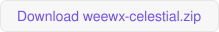
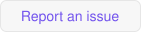
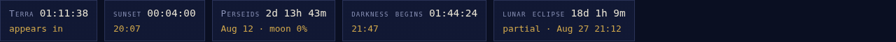
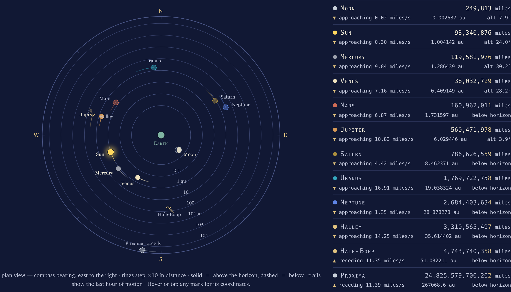
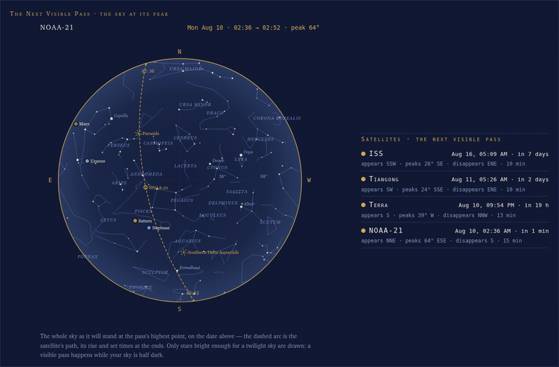
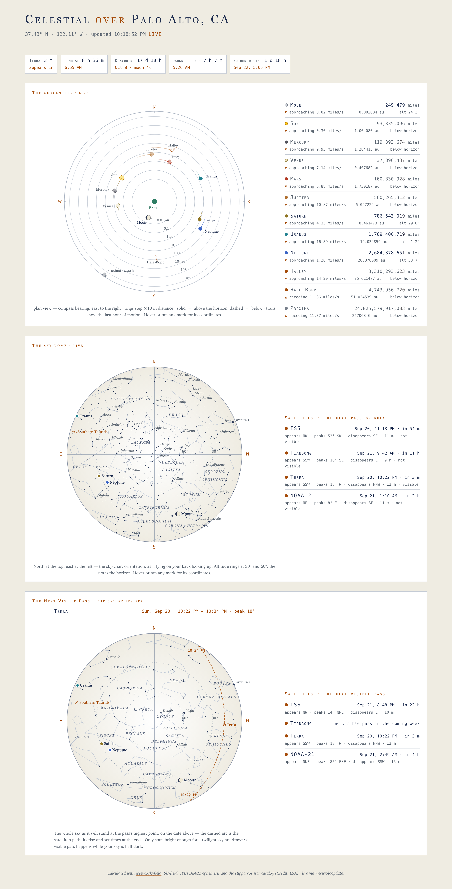

# weewx-celestial — Watch the sky move
Open source plugin for WeeWX software.

Copyright (C)2022-2026 by John A Kline (john@johnkline.com)

[](https://chaunceygardiner.github.io/weewx-celestial/)
[](https://github.com/chaunceygardiner/weewx-celestial/releases/latest/download/weewx-celestial.zip)
[](https://github.com/chaunceygardiner/weewx-celestial/issues)

## What it is

weewx-celestial adds one page to your WeeWX site: **the sky over your station
as it stands this second**.  Where the sun, moon and eight planets are — the
compass bearing of each, how far away it is, whether it is up or below the
horizon.  Which stars and constellations are overhead.  Which satellites are
crossing right now, and when the next one will be bright enough to walk
outside and see.  Where each comet you follow has got to.  And how long you
have until sunset, until astronomical darkness, until the next meteor
shower's peak.

It is the bundled `Celestial` skin: a row of countdown chips over three
panels — the Geocentric dial, the live sky dome, and the Next Visible Pass
chart.

Everything on it moves.  The page updates from `loop-data.txt` on every loop
record (every 2 seconds with the Vantage driver), and between refreshes it
advances each readout at the body's own derived rate, re-anchoring to truth
on the next packet and freezing rather than inventing data if the feed goes
stale.


**Countdown central** — ticking chips for the soonest visible satellite
pass, sunset or sunrise, the next meteor shower's peak with the moon's
illumination at the peak, and astronomical darkness; joined within ~30 days
by the next equinox or solstice, Earth's perihelion or aphelion, the next
supermoon, the next eclipse visible from your station, and each configured
comet's perihelion.  Each chip is client-side arithmetic on an event instant
weewx-loopdata computes once and caches until it passes — so a sunset chip
counts to zero and rolls itself to the next sunrise, with no reload:



**The Geocentric** — Earth at the center, every body (sun, moon, the eight
planets, Proxima Centauri) placed by compass bearing and log distance, the
moon at its true phase, bodies below the horizon dimmed and dashed, an
hour-long motion trail behind every dot, and a roster whose distance
odometers tick between packets at each body's true radial rate.  With
weewx-skyfield 2.1, every configured comet joins the dial as a diamond whose
three-ray tail fans anti-sunward — solid when naked-eye bright, and honestly
absent when the Minor Planet Center has dropped its elements.



**The sky dome** — everything above the horizon right now: weewx-skyfield's
own chart, the full Hipparcos star field and constellation figures included,
embedded as a live instrument, with each configured satellite's marker
crossing it in real time — solid when sunlit, a hollow ring inside Earth's
shadow, dimmed under a bright sky:


**The Next Visible Pass** — the whole sky as it will stand at the culmination
of the soonest upcoming *visible* pass, the pass's arc dashed across it,
with the satellite's dot swept live along that arc during the show and
flipping between sunlit and in-shadow in step with the dome's marker:



**Dark, light or following the sun** — the page ships as the night plate
above, and takes a paper-atlas plate with `theme = light`, or `auto` to
run light while the sun is up and dark after it sets.  The whole page
changes together: the sky dome and the Next Visible Pass chart are
rendered on weewx-skyfield's matching palette rather than left as a night
rectangle in a light page.  It is settled when the report is generated —
the charts arrive with their colors already inside them, so there is
nothing for a browser toggle to switch, and the page does not follow the
viewer's operating system.  See
[Dark, light and auto](https://chaunceygardiner.github.io/weewx-celestial/configuration.html#dark-light-and-auto).



The live values are **weewx-loopdata almanac fields**: report almanac tags
(computed by the registered almanac, ideally weewx-skyfield's) that
weewx-loopdata evaluates on every loop packet and publishes in
`loop-data.txt`.  One computation engine serves the report tags and the live
page, so they always agree.  This extension runs no service and computes
nothing itself.

For the rest of the sky *atlas* — sun path, orrery, analemma, solar year,
lunation and rise/set timeline — see weewx-skyfield's own
[Sky page](https://chaunceygardiner.github.io/weewx-skyfield/sky-page.html).
weewx-skyfield is the atlas; weewx-celestial is the live instrument.

## Requirements

**This extension requires Python 3.9 or later, WeeWX 5.2 or later,
[weewx-loopdata](https://github.com/chaunceygardiner/weewx-loopdata) 6.9 or
later, and (strongly recommended)
[weewx-skyfield](https://github.com/chaunceygardiner/weewx-skyfield) — 2.1 or
later for the comets, the meteor showers and the full countdown row; 2.0
serves the sky dome's satellites and the Next Visible Pass chart; 1.15 or
later for the light plate, which is the paper those charts are drawn on.**

## Installing

1. Install [weewx-loopdata](https://github.com/chaunceygardiner/weewx-loopdata)
   6.9+ and [weewx-skyfield](https://github.com/chaunceygardiner/weewx-skyfield)
   2.1+, per their instructions.

1. Download `weewx-celestial.zip` from the
   [release page](https://github.com/chaunceygardiner/weewx-celestial/releases)
   and install it:

   ```
   weectl extension install weewx-celestial.zip
   ```

   The installer appends the loop-data fields the page reads to your
   `[LoopData] [[Include]] fields` line — append-only, printing each one.

1. Point weewx-loopdata's output where the page looks, then restart WeeWX.
   The report appears under `celestial/` of your web root.

The full procedure — including the loopdata wiring that is the one step most
often gotten wrong, and how to verify the feed afterwards — is in
**[the manual's Installation page](https://chaunceygardiner.github.io/weewx-celestial/installation.html)**.
Upgrading from 8.x, 7.x, 6.x or 5.x is covered in
**[Upgrading](https://chaunceygardiner.github.io/weewx-celestial/upgrading.html)**.

## Where to find things

The [user manual](https://chaunceygardiner.github.io/weewx-celestial/) covers
all of it, with a sidebar and full-text search:

| Question | Page |
|---|---|
| How do I install it? | [Installation](https://chaunceygardiner.github.io/weewx-celestial/installation.html) |
| I'm on an older version | [Upgrading](https://chaunceygardiner.github.io/weewx-celestial/upgrading.html) |
| What am I looking at? | [Reading the page](https://chaunceygardiner.github.io/weewx-celestial/reading-the-page.html) |
| How does it stay live? | [How the page stays live](https://chaunceygardiner.github.io/weewx-celestial/how-it-stays-live.html) |
| What are the report's options? | [Configuration](https://chaunceygardiner.github.io/weewx-celestial/configuration.html) |
| Can I have a light page? | [Dark, light and auto](https://chaunceygardiner.github.io/weewx-celestial/configuration.html#dark-light-and-auto) |
| Can I watch other satellites or comets? | [Satellites and comets](https://chaunceygardiner.github.io/weewx-celestial/satellites-and-comets.html) |
| Which loop-data fields does it read? | [Fields reference](https://chaunceygardiner.github.io/weewx-celestial/fields-reference.html) |
| Can I have it in my language? | [Translations](https://chaunceygardiner.github.io/weewx-celestial/i18n.html) |
| Can I build my own live page? | [In your own skin](https://chaunceygardiner.github.io/weewx-celestial/own-skin.html) |
| Something is wrong | [Troubleshooting](https://chaunceygardiner.github.io/weewx-celestial/troubleshooting.html) |

German, French, Danish, Dutch, Spanish, Italian, Norwegian (Bokmål) and
Swedish ship with the skin; further languages are welcome as contributions —
a lang file is a self-contained, no-code contribution.

## Testing

```
cd weewx-celestial                       # your checkout
<weewx-venv>/bin/python -m pytest tests   # the WeeWX virtual environment
```

The suite renders the bundled skin end to end through Cheetah's errorCatcher
with the weewx-skyfield, PyEphem and built-in almanacs (skipping the
weewx-skyfield tier when that extension is not importable), ties the
javascript's loop-data keys to the migrator's field set, lints the
javascript's top-level names against hazardous window globals,
cross-checks every entry the migration utility can produce against the
weewx-loopdata almanac-field parser (when a weewx-loopdata checkout is
available), and audits the manual against the code — the fields reference
against the migrator's field set, the translation dictionary against the
skin's `lang/en.conf`, the report's options across skin.conf, the templates
and the manual, every link and anchor between manual pages, and that every
screenshot the manual shows is a file this repository ships.

It runs against WeeWX 5.2 — this extension's minimum — as well as current
WeeWX.  On 5.2 the eight shipped-language render tests skip, stating why:
they assert translated body names, which need the report `[Almanac]`
section WeeWX only began providing in 5.3.

When a Playwright environment is available it also loads the
served page in headless Chromium with an advancing loop-data feed and asserts
the live machinery comes up — no page errors, dial dots drawn, rates derived,
trails visible.

## Why require Python 3.9 or later?

weewx-celestial is tested on Python 3.9 and later.  WeeWX 5.2 — this
extension's minimum, the first release with extensible almanacs — runs on
older Pythons, but the test matrix here does not.

## Licensing

weewx-celestial is licensed under the GNU Public License v3.
