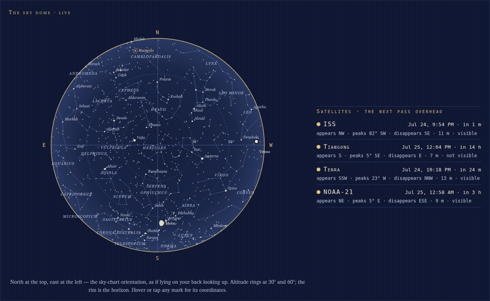
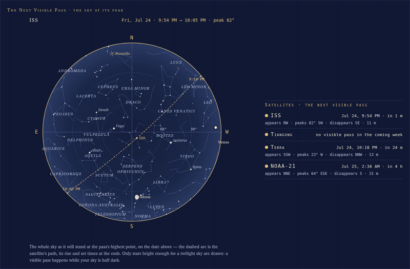
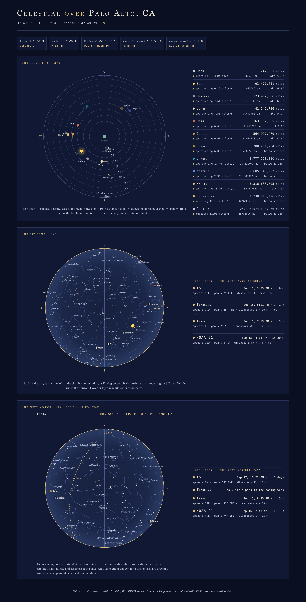
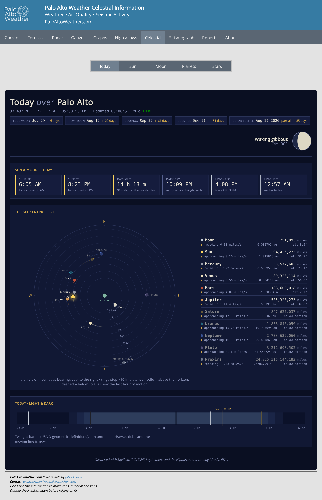

# weewx-celestial – Watch the sky move
Open source plugin for WeeWX software.

Copyright (C)2022-2026 by John A Kline (john@johnkline.com)

[User manual](https://chaunceygardiner.github.io/weewx-celestial/) ·
[GitHub project](https://github.com/chaunceygardiner/weewx-celestial)

**This extension requires Python 3.9 or later, WeeWX 5.2 or later,
[weewx-loopdata](https://github.com/chaunceygardiner/weewx-loopdata) 6.9 or
later, and (strongly recommended)
[weewx-skyfield](https://github.com/chaunceygardiner/weewx-skyfield) — 2.0 or
later for the sky dome's satellites and the Next Visible Pass chart.**

## Description

weewx-celestial ships a live celestial page (the bundled `Celestial` skin)
built around three panels.  **The Geocentric** — Earth at the center,
every body (sun, moon, the eight planets, Proxima Centauri) placed by
compass bearing and log distance, the moon at its true phase, bodies below
the horizon dimmed and dashed, and an hour-long motion trail behind every
dot.  Beside the dial, a roster gives each body an odometer distance
readout that ticks between loop refreshes at the body's true radial rate
(Mercury can recede ~28 km every second while Saturn approaches at the
same pace), plus the raw astronomical-unit value and the current altitude.

**The sky dome** (new in 8.0) is everything above the horizon right now:
weewx-skyfield's own dome chart — the full Hipparcos star field, the
constellation figures, the sun, the moon at its true phase and the
planets — embedded as a live instrument.  Each report cycle renders a
staggered set of backdrops a minute apart, and the open page steps to
the one covering the current minute — a quarter-degree step the eye
doesn't catch, never a whole cycle's rotation at once — while the
sun/moon/planet marks are nudged between steps at loop-derived rates.  With weewx-skyfield 2.0's satellites configured (the
installer defaults to the ISS and Tiangong) the dome carries the layer
that genuinely moves: the satellite marker crossing the dome in real
time — drawn whenever the satellite is up, dimmed unless you could
actually see it (satellite sunlit, sky dark) — and a roster row per
satellite counting down to its next pass of ANY kind, each tagged
visible or not visible, so you know when the dome show starts — rolling
into "overhead now" during it — with honest rows ("no pass in the
coming week", "no usable orbital elements — see the weewxd log") when
that is the truth.

The dome during the ISS's July 24 near-zenith visible pass (replayed
through the live page with the orbital elements Space-Track archived
that day; 2-second frames played at about 30× speed).  The full-brass
dot crosses the whole dome NW → SE, and near the end it snaps to a
hollow ring as the ISS enters Earth's shadow — how visible passes
really end:



**The Next Visible Pass panel** (also 8.0, satellites configured) is the
visible-pass story: the whole sky as it will stand at the culmination of
the soonest upcoming visible pass, the pass's arc dashed across it with
rise and set times at the ends, under a dated head line — one chart, one
epoch, so the arc crosses the stars it will actually cross — beside a
roster of each satellite's next VISIBLE pass, the ones worth stepping
outside for.  During the pass itself the chart's moment is only minutes
from now, and the page sweeps the satellite's dot live along the drawn
arc.  When no configured satellite has a visible pass coming in its
elements' validity window the chart area hides and the roster's honest
rows say why; the open page refetches the chart every five minutes, so a
completed pass's chart rolls over to the next pass by itself.

The same July 24 pass on this panel — the chart features it, so the
sweep dot rides the dashed arc from the 21:54 rise to the 22:05 set
while the visible-pass roster counts down beside it:



Everything on the page moves.  The dial and roster update from
`loop-data.txt` on every loop record (for the Vantage driver, every 2
seconds), and between refreshes the page derives each body's rate of
motion from consecutive packets and advances the readouts every second —
re-anchoring to truth on the next packet, and freezing rather than
inventing data if the feed goes stale.

For the rest of the sky *charts* — sun path, orrery, analemma, solar
year, lunation and rise/set timeline — see weewx-skyfield's own Sky page.
weewx-skyfield is the atlas; weewx-celestial is the live instrument: 7.0
removed every embedded chart, and 8.0 brings back only the
satellite-driven pair — the dome and the Next Visible Pass chart — because LEO
satellites gave them something that genuinely moves; both are still
drawn by weewx-skyfield.

The bundled sample report (Palo Alto, a July evening at 9:12 PM — the
first-quarter moon high in the southwest trailing its wake, Mercury and
Mars in the west, the freshly set sun dashed below the horizon, Proxima
Centauri alone at the rim, and every odometer ticking):


The live values are **weewx-loopdata almanac fields**: report almanac tags
(computed by the registered almanac, ideally weewx-skyfield's) that
weewx-loopdata evaluates on every loop packet and publishes in
`loop-data.txt`.  One computation engine serves the report tags and the
live page, so they always agree.  This extension runs no service and
computes nothing itself.

What installs:

- The `Celestial` skin (the sample report), registered as `CelestialReport`.
- The `celestial_sky` guard-only search list: it serves `$sky_page` — the
  real weewx-skyfield sky page when that extension is installed, `None`
  otherwise — so the dome panel degrades to an install hint instead of
  killing report generation.
- The `--migrate-loopdata-fields` command-line utility (see upgrading),
  and the `--add-satellite`/`--remove-satellite` utility that makes (or
  unmakes) every weewx.conf edit a satellite takes in one command (see
  installing).

The page first-paints at report time from `$almanac` and then goes live
from loop data.  What you see depends on the almanac WeeWX has: with
**weewx-skyfield 2.0** (satellites configured), everything — Proxima, the
dome, the Next Visible Pass chart, and the live satellite layer.  With an earlier
**weewx-skyfield**, everything but the satellites and their chart, and
the dome's marks step only at the once-a-minute backdrop step (the
live-nudge hooks are 2.0's).  With **PyEphem** (no weewx-skyfield), the Geocentric
minus the Proxima Centauri row, and no dome or chart — the dome panel
shows an install hint.  With only WeeWX's **built-in
almanac**, the page generates but both panels show install hints — the
built-in almanac serves none of the positions or distances this page runs
on, which is why weewx-skyfield is strongly recommended.

# Installation Instructions

1. Install [weewx-loopdata](https://github.com/chaunceygardiner/weewx-loopdata)
   6.9 or later and
   [weewx-skyfield](https://github.com/chaunceygardiner/weewx-skyfield)
   2.0 or later, both per their instructions.

1. Download `weewx-celestial.zip` from the release page, then:

   ```
   weectl extension install weewx-celestial.zip
   ```

1. Add the fields the report reads to the `fields` line of
   `[LoopData] [[Include]]` in `weewx.conf`.  The line must stay a BARE
   comma-separated list (no brackets or quotes).  Append:

   ```
   current.dateTime.raw, almanac.sun.az, almanac.sun.alt, almanac.sun.earth_distance, almanac.moon.az, almanac.moon.alt, almanac.moon.earth_distance, almanac.moon.phase, almanac.next_full_moon.unix_epoch.raw, almanac.next_new_moon.unix_epoch.raw, almanac.mercury.az, almanac.mercury.alt, almanac.mercury.earth_distance, almanac.venus.az, almanac.venus.alt, almanac.venus.earth_distance, almanac.mars.az, almanac.mars.alt, almanac.mars.earth_distance, almanac.jupiter.az, almanac.jupiter.alt, almanac.jupiter.earth_distance, almanac.saturn.az, almanac.saturn.alt, almanac.saturn.earth_distance, almanac.uranus.az, almanac.uranus.alt, almanac.uranus.earth_distance, almanac.neptune.az, almanac.neptune.alt, almanac.neptune.earth_distance, almanac.pluto.az, almanac.pluto.alt, almanac.pluto.earth_distance, almanac.proxima_centauri.az, almanac.proxima_centauri.alt, almanac.proxima_centauri.earth_distance, almanac.iss.az, almanac.iss.alt, almanac.iss.sunlit, almanac.iss.label, almanac.iss.next_visible_pass.rise.unix_epoch.raw, almanac.iss.next_visible_pass.set.unix_epoch.raw, almanac.iss.next_visible_pass.max_altitude.degree_angle.raw, almanac.iss.next_visible_pass.duration.second.raw, almanac.iss.next_visible_pass.rise_azimuth.ordinal_compass, almanac.iss.next_visible_pass.culmination_azimuth.ordinal_compass, almanac.iss.next_visible_pass.set_azimuth.ordinal_compass, almanac.iss.next_pass.rise.unix_epoch.raw, almanac.iss.next_pass.set.unix_epoch.raw, almanac.iss.next_pass.max_altitude.degree_angle.raw, almanac.iss.next_pass.duration.second.raw, almanac.iss.next_pass.rise_azimuth.ordinal_compass, almanac.iss.next_pass.culmination_azimuth.ordinal_compass, almanac.iss.next_pass.set_azimuth.ordinal_compass, almanac.iss.next_pass.visible, almanac.tiangong.az, almanac.tiangong.alt, almanac.tiangong.sunlit, almanac.tiangong.label, almanac.tiangong.next_visible_pass.rise.unix_epoch.raw, almanac.tiangong.next_visible_pass.set.unix_epoch.raw, almanac.tiangong.next_visible_pass.max_altitude.degree_angle.raw, almanac.tiangong.next_visible_pass.duration.second.raw, almanac.tiangong.next_visible_pass.rise_azimuth.ordinal_compass, almanac.tiangong.next_visible_pass.culmination_azimuth.ordinal_compass, almanac.tiangong.next_visible_pass.set_azimuth.ordinal_compass, almanac.tiangong.next_pass.rise.unix_epoch.raw, almanac.tiangong.next_pass.set.unix_epoch.raw, almanac.tiangong.next_pass.max_altitude.degree_angle.raw, almanac.tiangong.next_pass.duration.second.raw, almanac.tiangong.next_pass.rise_azimuth.ordinal_compass, almanac.tiangong.next_pass.culmination_azimuth.ordinal_compass, almanac.tiangong.next_pass.set_azimuth.ordinal_compass, almanac.tiangong.next_pass.visible
   ```

   (Entries already present — e.g. `current.dateTime.raw` — need not be
   repeated; weewx-loopdata ignores duplicates.  The `almanac.iss.*` and
   `almanac.tiangong.*` entries feed the live satellite layer and need
   weewx-skyfield 2.0 with its default `[[Satellites]]`; on an older
   almanac they are simply omitted from `loop-data.txt` — one weewxd log
   line per field — and the page hides its satellite layer, so they are
   safe to add either way.  The installer checks this line at install
   time and prints tailored `--migrate-loopdata-fields` commands when
   entries the page reads are missing — it never edits `[LoopData]`
   itself.)

   To watch more satellites than the installer's two, use the bundled
   utility — a satellite is three separate weewx.conf edits (the
   `[Skyfield]` `[[Satellites]]` entry, the same nineteen fields-line
   entries with its tag name, the display name), and one command makes
   them all, one satellite per run:

   ```
   python -m user.celestial --add-satellite zenit23088=23088 --name 'Zenit-2 23088' --config /home/weewx/weewx.conf --output /tmp/weewx.conf.new
   ```

   Review the changes and move the file into place (or use `--in-place`,
   which backs the original up first).  Use a word-diff to review — the
   fields line is one long comma-separated value, so a plain `diff`
   shows only two unreadable lines:

   ```
   git diff --no-index --word-diff /home/weewx/weewx.conf /tmp/weewx.conf.new
   ```  Every edit is idempotent — a
   satellite already configured per weewx-skyfield's instructions just
   gains its fields entries, and re-running updates the number or name
   in place.  `--remove-satellite zenit23088` is the exact inverse.  The
   page's roster and live layer follow your `[[Satellites]]`
   configuration automatically; hand-editing remains fine too — append
   the nineteen entries with your tag in place of `iss`, and set the
   display name once, station-wide, under `[StdReport]` `[[Defaults]]`
   in `weewx.conf` — usually better than any single report's section,
   because the same entry serves this page's first paint,
   weewx-skyfield's own Sky page, and loopdata's target report, whose
   `[Almanac]` is what the live `almanac.<sat>.label` fields render
   with:

   ```
   [StdReport]
       [[Defaults]]
           [[[Almanac]]]
               zenit23088 = Zenit-2 23088
   ```

1. Point weewx-loopdata's output where the page looks.  The skin fetches
   `loop_data_file` — default `../loop-data.txt`, the directory above
   this report, i.e. your web root — while weewx-loopdata's own defaults
   (`[LoopData]` `[[Formatting]] target_report = LoopDataReport`,
   `[[FileSpec]] loop_data_dir = .`) write `loop-data.txt` into the
   LoopData report's directory instead.  Make the two meet: with the
   default target report, set `loop_data_dir = ..` (`loop_data_dir` is
   relative to the target report's HTML_ROOT), or point this report's
   `loop_data_file` (see the `CelestialReport` entries below) at
   wherever your loopdata already writes.  A mismatch is easy to spot:
   the page's badge reads "NO DATA (HTTP 404) — check loop_data_file".

1. Restart WeeWX.  The report appears under `celestial/` of your web root.

# Upgrade Instructions (from 6.x)

1. Uninstall the old version, then install this version:

   ```
   weectl extension uninstall celestial
   weectl extension install weewx-celestial.zip
   ```

1. Restart WeeWX.  (The restart also refreshes the deployed
   `celestial.css` and `sky.js` — CopyGenerator re-copies `copy_once`
   files on every report first-run — and the page version-tags both
   URLs, so browsers refetch them too.)

Your existing `[LoopData] [[Include]] fields` line keeps working as is —
7.0 reads a subset of the 6.0 field set plus three new entries, so add
`almanac.proxima_centauri.az, almanac.proxima_centauri.alt` (the
migration utility adds them too, but for a 6.0 line it is simpler by
hand).  The remaining 6.0 entries (rise/sets, twilights, ra/dec,
equinox/solstice, `almanac.moon_phase`, `almanac.moon_index`, sun
visible-time) are no longer read by this skin; keep them if your own
pages consume them, or trim them to the list above.

If you still list `user.celestial.Celestial` under `data_services` in
`[Engine] [[Services]]` (a leftover from 2.x that 6.x tolerated with a
stub), **remove it now**: 7.0 deletes the stub, and a stale entry will
keep weewxd from starting.

# Upgrade Instructions (from 5.x or earlier)

6.0 removed this extension's loop fields (`current.sunrise`,
`current.earthMarsDistance`, `current.moonWaxing`, …); almanac fields
replace them.  The sequence matters — the migration utility ships with
this extension, so this version must be installed before it can run:

1. **Uninstall the old version** (required — see the 6.x note above about
   `data_services`):

   ```
   weectl extension uninstall celestial
   ```

   `weectl extension install` over an existing version only overlays
   files; it never reverses what the old version registered.
   Uninstalling first (while the old install record still exists) removes
   the old service registration and the bundled
   `celestial_de421.bsp`/`celestial_stars.dat` files.  If those linger,
   delete `user.celestial.Celestial` from `data_services` in
   `[Engine] [[Services]]` and remove the two orphaned `celestial_*` data
   files from `bin/user` by hand.

1. Install [weewx-loopdata](https://github.com/chaunceygardiner/weewx-loopdata)
   6.9+ and [weewx-skyfield](https://github.com/chaunceygardiner/weewx-skyfield)
   2.0+ if you have not already, then install this version.

1. Run the bundled utility to rewrite your `[LoopData] [[Include]] fields`
   line — every celestial entry (including pre-3.0 PascalCase names)
   becomes its almanac equivalent, rendition suffixes are honored,
   non-celestial entries are never touched, and the fields the report
   needs are appended.  The satellite entries follow your `[Skyfield]`
   `[[Satellites]]` — fields for exactly the satellites you have
   configured, the installer defaults (iss, tiangong) only when there
   is no `[[Satellites]]` section to follow.  Raw times and durations
   arrive with pinned units
   (`almanac.sunrise.unix_epoch.raw`, `almanac.sun.visible.second.raw`),
   so they keep the old fields' fixed meanings — epoch seconds, seconds
   of daylight — no matter how loopdata's target report units are set:

   ```
   source /home/weewx/weewx-venv/bin/activate
   cd /home/weewx/bin    # the directory CONTAINING the `user` package
                         # (~/weewx-data/bin on pip installs)
   python -m user.celestial --migrate-loopdata-fields --config /home/weewx/weewx.conf --output /tmp/weewx.conf.migrated
   git diff --no-index --word-diff /home/weewx/weewx.conf /tmp/weewx.conf.migrated   # review, then move into place
   ```

   (`--in-place` edits weewx.conf directly after making a
   `.bak-celestial-<version>` backup; `--print-fields-value` just prints the
   migrated line for cut-and-paste.)

1. Restart WeeWX.

If your own pages read the old fields, note the three changes with no
1:1 equivalent:

- **Distances arrive as raw astronomical units** (the value reports show),
  no longer miles/km — convert in the page (× 92,955,807 miles/AU or
  × 149,597,870 km/AU).  Proxima Centauri is AU as well, no longer light
  years (÷ 63,241.077 AU/ly).
- **`almanac.moon.phase`** (the `moonFullness` replacement) is a raw
  percent (e.g. `33.6`), no longer a formatted string.
- **`moonWaxing` is gone**: the moon is waxing exactly when
  `almanac.next_full_moon.unix_epoch.raw <
  almanac.next_new_moon.unix_epoch.raw` (the bundled skin shows the
  derivation).

The `[Celestial]` section of weewx.conf (`enable`, `update_rate_secs`,
`stars`) is obsolete and can be deleted.  The Skyfield and NumPy libraries
are no longer required by this extension (weewx-skyfield requires them,
and has its own ephemeris and star catalog).

## Entries in `CelestialReport` section of `weewx.conf`:

```
[StdReport]
    [[CelestialReport]]
        HTML_ROOT = celestial
        enable = true
        skin = Celestial
        [[[Extras]]]
            loop_data_file = ../loop-data.txt
            refresh_rate = 2
            expiration_time = 24
            page_update_pwd = foobar
```

- `loop_data_file`: where the javascript fetches loop data; relative paths
  are relative to this report's HTML_ROOT.
- `refresh_rate`: seconds between loop-data polls (match weewx-loopdata's
  write cadence: 2 for the Vantage driver).
- `expiration_time`: hours the page keeps polling before requiring a click
  (`?pageUpdate=<page_update_pwd>` in the URL disables expiration).
- The skin's `time_zone` Extras option (see `skin.conf`) controls the
  timezone of displayed times; by default the station's zone is
  auto-detected at report time.

## Translations

As of 7.2 the page is translatable, entirely through WeeWX's own
mechanisms — lang files, `[Texts]`/`$gettext`, and the `[Almanac]`
section — the same machinery as
[weewx-skyfield](https://github.com/chaunceygardiner/weewx-skyfield)'s Sky
page.  Every string is keyed by its English text and falls back to English
one string at a time, so a partial translation is fine.  The live values
the javascript writes (badge, roster, dial labels) are translated at
report-generation time and fed to the script, so the page stays in one
language end to end.

**German, French, Danish, Dutch, Spanish, Italian, Norwegian (Bokmål)
and Swedish ship with the skin**
(`lang/de.conf` and `lang/fr.conf` native-speaker reviewed, `lang/da.conf`
contributed by native speaker Gert Andersen, the rest Beta awaiting their
reviews; each kept complete by a test —
body names, moon phases and all 88 constellation names shared verbatim
with weewx-skyfield's own lang files).  To use one:

```
[StdReport]
    [[CelestialReport]]
        lang = de                # or fr, da, nl, es, it, no, or sv
```

For any other language, copy `skins/Celestial/lang/en.conf` (the reference
dictionary — every string the page renders, and nothing else) to
`<code>.conf` beside it and translate the values; the keys stay English,
and `{named}` placeholders may be reordered but not renamed.  Or set
`lang = de` once under `[StdReport] [[Defaults]]` and every skin that
ships German switches together.  Further languages are welcome as
contributions — a lang file is a self-contained, no-code contribution.

Two notes:

- Times (the clock and the last-update stamp) format per the report's
  `lang` via the browser's own locale rules; no dictionary entries needed.
- Loop-data **values** already localize with no work here: weewx-loopdata
  5.0+ evaluates almanac fields with its *target report's* `[Almanac]`
  texts, so fields like `almanac.moon.label` or
  `almanac.mars.constellation.label` arrive in the target report's
  language — one language per loopdata instance.

The manual's
[Translating the Celestial page](https://chaunceygardiner.github.io/weewx-celestial/i18n.html)
covers all of this in full — the translation channels, the station-wide
`[[Defaults]]` route, surviving upgrades, and the complete reference
dictionary.

## Adding the Geocentric (or your own live panel) to your own skin

Everything the sample skin does is ordinary weewx-loopdata consumption:
list the almanac fields you want in `[LoopData] [[Include]] fields`, give
your HTML elements ids equal to the json keys, and poll `loop-data.txt`
from javascript.  `skins/Celestial/realtime_updater.inc` is the reference
implementation — the dial, the rate derivation (two consecutive packets
give each body its motion; the one-second tick extrapolates between
refreshes) and the odometer are self-contained functions you can lift,
and `skins/Celestial/celestial.css` holds every color.  The full
almanac-field grammar (any report almanac tag with the `$` removed, plus
the `almanac(days=±N)` tomorrow/yesterday extension) is documented in
[weewx-loopdata's README](https://github.com/chaunceygardiner/weewx-loopdata#almanac-fields).

## The Geocentric Live on PaloAltoWeather.com

[PaloAltoWeather.com's Celestial Today page](https://www.paloaltoweather.com/celestial.html)
contains a Geocentric Live panel built with the same technologies as used here
([weewx-skyfield](https://github.com/chaunceygardiner/weewx-skyfield) and
[weewx-loopdata](https://github.com/chaunceygardiner/weewx-loopdata)).



## Testing

### Automated tests

```
cd ~/software/weewx-celestial     # your checkout
/home/weewx/weewx-venv/bin/python -m pytest tests
```

The suite renders the bundled skin end to end through Cheetah's
errorCatcher with the weewx-skyfield, PyEphem and built-in almanacs
(skipping the weewx-skyfield tier when that extension is not importable),
ties the javascript's loop-data keys to the migrator's field set, lints
the javascript's top-level names against hazardous window globals, and
cross-checks every entry the migration utility can produce against the
weewx-loopdata almanac-field parser (when a weewx-loopdata checkout is
available).  When a Playwright environment is available it also loads the
served page in headless Chromium with an advancing loop-data feed and
asserts the live machinery comes up — no page errors, dial dots drawn,
rates derived, trails visible.

### Command line check

To sanity check an installed configuration, confirm the `almanac.*` keys
appear in `loop-data.txt` after a restart:

```
python3 -c "import json; d=json.load(open('/home/weewx/gauge-data/loop-data.txt')); print(sorted(k for k in d if k.startswith('almanac')))"
```

## Why require Python 3.9 or later?

weewx-celestial is tested on Python 3.9 and later.  WeeWX 5.2 — this
extension's minimum, the first release with extensible almanacs — runs on
older Pythons, but the test matrix here does not.

## Licensing

weewx-celestial is licensed under the GNU Public License v3.
