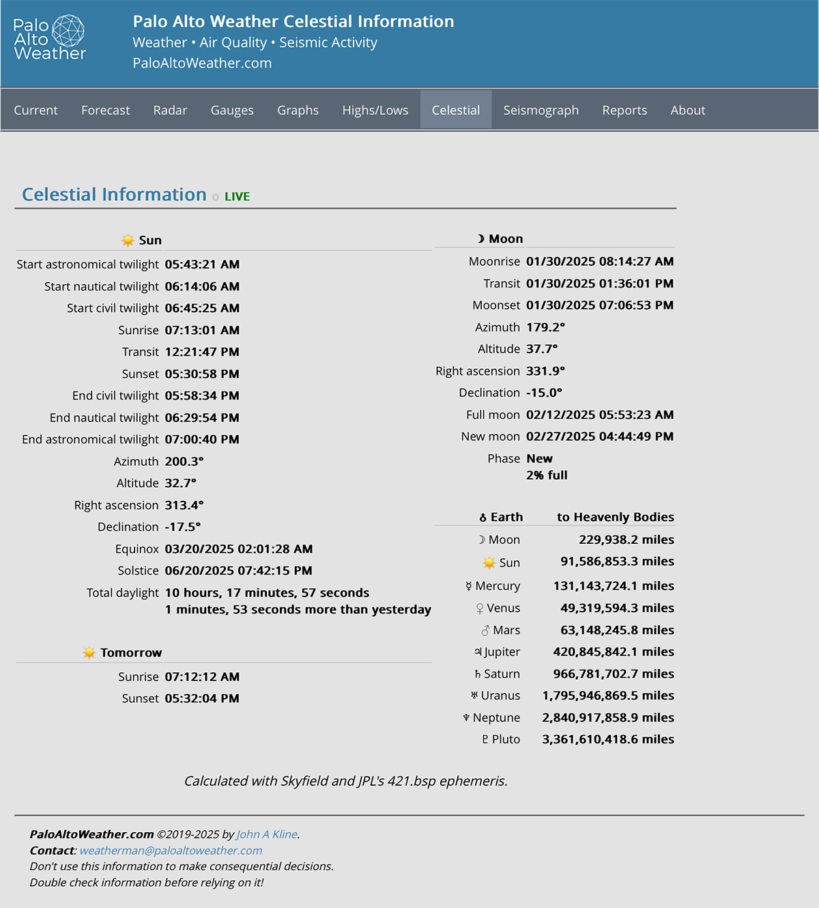

# weewx-celestial
*Open source plugin for WeeWX software.

Copyright (C)2022-2025 by John A Kline (john@johnkline.com)

**This extension requires Python 3.9 or later, WeeWX 4 or 5 and the Skyfield and NumPy libraries.**


## Description

Celestial is a WeeWX service that inserts celestial observations into loop packets.
The information is then available via
[weewx-loopdata plugin](https://github.com/chaunceygardiner/weewx-loopdata), as `current.<celestial-obs>`

As of version 2.0, weewx-celestial uses [Skyfield](https://rhodesmill.org/skyfield/) for *much* more accurate
information than [PyEphem](https://rhodesmill.org/pyephem/index.html), which is currently used by WeeWX.

As of version 2.3, celestial observations are only recomputed every ten seconds (by default) rather than
on every loop record.  That is, the observations will be inserted into every loop record, but the observations
will only be updated every ten seconds.

The information available in loop records, as well as the sample report provided is based on WeeWX's
Seasons Report (Copyright Tom Keffer and Matthew Wall).  More fields are provided than in the Seasons
report, including start/end times for astronomical and nautical twilight.  Also, distances from earth to
the other planets (and Pluto); as well as the current distance to the moon and sun.

In the sample report, none of the values are generated at report time.  All are provided via javascript,
reading the loop-data.txt file, and updated on every loop record (for the Vantage driver, that happens
every 2 seconds).

See weewx-celestial in action with at
[www.paloaltoweather.com/celestial.html](https://www.paloaltoweather.com/celestial.html)
A screen shot is below:


This extension also comes with a sample report.


The following observations are available in the LOOP packet:

- `AstronomicalTwilightEnd`
- `AstronomicalTwilightStart`
- `CivilTwilightEnd`
- `CivilTwilightStart`
- `daySunshineDur`
- `EarthJupiterDistance`
- `EarthMarsDistance`
- `EarthMercuryDistance`
- `EarthNeptuneDistance`
- `EarthMoonDistance`
- `EarthPlutoDistance`
- `EarthSaturnDistance`
- `EarthSunDistance`
- `EarthUranusDistance`
- `EarthVenusDistance`
- `MoonAltitude`
- `MoonAzimuth`
- `MoonDeclination`
- `MoonFullness`
- `MoonPhase`
- `MoonRightAscension`
- `Moonrise`
- `Moonset`
- `MoonTransit`
- `NauticalTwilightEnd`
- `NauticalTwilightStart`
- `NextEquinox`
- `NextFullMoon`
- `NextNewMoon`
- `NextSolstice`
- `SunAltitude`
- `SunAzimuth`
- `SunDeclination`
- `SunRightAscension`
- `Sunrise`
- `Sunset`
- `SunTransit`
- `tomorrowSunrise`
- `tomorrowSunset`
- `yesterdaySunshineDur`

# Upgrade Instructions

1. If you re upgrading from a previous version to 1.x, and you are using the sample skin, you'll need to add the following
   two fields to the `fields` line in `weewx.conf`:
   `current.tomorrowSunrise.raw, current.tomorrowSunset.raw`

1. If you are upgrading from 1.x versioun, you'll need to install skyfield.  See the install instructions above for how to install skyfield.

1. If you are upgrading from 2.0 to a later version, you'll need to add the following fields in the `fields` line in `weewx.conf`:
   `current.MoonTransit`
   `current.Moonrise`
   `current.Moonset`

1. As of version 2.3, `update_rate_secs = 10` will be added to the `[Celestial]` section of weewx.conf.  This results in celestial fields being
   updated no more than every 10s or every loop record, whichever is longer.  To return the behavior to updating on every loop record, simply
   replace the `10` with `0`.


# Installation Instructions

## WeeWX 5 Installation Instructions

1. If pip install,
   Activate the virtual environment (actual syntax varies by type of WeeWX install):
   `/home/weewx/weewx-venv/bin/activate`
   Install the prerequisite skyfield package.
   `pip install skyfield`

1. If package install:
   Install the prerequisite skyfield package.  On debian, that can be accomplished with:
   `sudo apt install python3-skyfield` 

1. Install the latest release of weewx-loopdata at

   [weewx-loopdata GitHub repository](https://github.com/chaunceygardiner/weewx-loopdata).

1. Download the lastest release, weewx-celestial.zip, from

   [weewx-celestial GitHub Repository](https://github.com/chaunceygardiner/weewx-celestial).

1. Install the celestial extension.

   `weectl extension install weewx-celestial.zip`

1. Add the following fields to the `[LoopData][[Include]][[[fields]]]` line in `weewx.conf`.  (They are used by the sample report.)

   `current.AstronomicalTwilightEnd.raw, current.AstronomicalTwilightStart.raw, current.CivilTwilightEnd.raw, current.CivilTwilightStart.raw, current.EarthJupiterDistance, current.EarthMarsDistance, current.EarthMercuryDistance, current.EarthMoonDistance, current.EarthNeptuneDistance, current.EarthPlutoDistance, current.EarthSaturnDistance, current.EarthSunDistance, current.EarthUranusDistance, current.EarthVenusDistance, current.MoonAltitude.raw, current.MoonAzimuth.raw, current.MoonDeclination.raw, current.MoonFullness, current.MoonPhase, current.MoonRightAscension.raw, current.MoonTransit, current.MoonTransit.raw, current.Moonrise, current.Moonrise.raw, current.Moonset, current.Moonset.raw, current.NauticalTwilightEnd.raw, current.NauticalTwilightStart.raw, current.NextEquinox, current.NextFullMoon, current.NextNewMoon, current.NextSolstice, current.SunAltitude.raw, current.SunAzimuth.raw, current.SunDeclination.raw, current.SunRightAscension.raw, current.SunTransit.raw, current.Sunrise.raw, current.Sunset.raw, current.daySunshineDur.raw, current.yesterdaySunshineDur.raw, current.tomorrowSunrise.raw, current.tomorrowSunset.raw`

1. Restart WeeWX.

1. After a reporting cycle runs, check navigate to `<weewx-url>/celestial/ in your browser
   to see the default celestial sample report. (Reports typcially run every 5 minutes.)

## WeeWX 4 Installation Instructions

1. Install the prerequisite skyfield package.  On debian, that can be accomplished with:
   `sudo apt install python3-skyfield` 

1. Install the latest release of weewx-loopdata at

   [weewx-loopdata GitHub repository](https://github.com/chaunceygardiner/weewx-loopdata).

1. Add the following fields to the `[LoopData][[Include]][[[fields]]]` line in `weewx.conf`.  (They are used by the sample report.)

   `current.AstronomicalTwilightEnd.raw, current.AstronomicalTwilightStart.raw, current.CivilTwilightEnd.raw, current.CivilTwilightStart.raw, current.EarthJupiterDistance, current.EarthMarsDistance, current.EarthMercuryDistance, current.EarthMoonDistance, current.EarthNeptuneDistance, current.EarthPlutoDistance, current.EarthSaturnDistance, current.EarthSunDistance, current.EarthUranusDistance, current.EarthVenusDistance, current.MoonAltitude.raw, current.MoonAzimuth.raw, current.MoonDeclination.raw, current.MoonFullness, current.MoonPhase, current.MoonRightAscension.raw, current.MoonTransit.raw, current.Moonrise.raw, current.Moonset.raw, current.NauticalTwilightEnd.raw, current.NauticalTwilightStart.raw, current.NextEquinox, current.NextFullMoon, current.NextNewMoon, current.NextSolstice, current.SunAltitude.raw, current.SunAzimuth.raw, current.SunDeclination.raw, current.SunRightAscension.raw, current.SunTransit.raw, current.Sunrise.raw, current.Sunset.raw, current.daySunshineDur.raw, current.yesterdaySunshineDur.raw, current.tomorrowSunrise.raw, current.tomorrowSunset.raw`

1. Download the lastest release, weewx-celestial.zip, from

   [weewx-celestial GitHub Repository](https://github.com/chaunceygardiner/weewx-celestial).

1. Run the following command.

   `sudo /home/weewx/bin/wee_extension --install weewx-celestial.zip`

   Note: this command assumes weewx is installed in /home/weewx.  If it's installed
   elsewhere, adjust the path of wee_extension accordingly.

1. Restart WeeWX.

1. After a reporting cycle runs, check navigate to `<weewx-url>/celestial/ in your browser
   to see the default celestial sample report. (Reports typcially run every 5 minutes.)

## Entries in `Celestial` section of `weewx.conf`:

```
[Celestial]
    enable = true
    update_rate_secs = 10
```

 * `enable`          : When true, the celestial observations are added to every loop record.
 * `update_rate_secs`: number of seconds that have to pass to recalculate observations (`0` to recalculate on every loop record).

## Entries in `CelestialReport` section of `weewx.conf`:

```
    [[CelestialReport]]
        HTML_ROOT = public_html/celestial
        enable = true
        skin = Celestial
        [[[Extras]]]
            loop_data_file = ../loop-data.txt
            expiration_time = 24
            page_update_pwd = foobar
```

 * HTML_ROOT        : The HTML output directory in which to write the report.
 * `enable`         : When true, the report is generated.
 * `skin`           : Must be `Celestial`
 * `loop_data_file` : The path of the loop-dat.txt file (written by the loopdata extension).
                      If a relative path is specified, it is relative to the
                     `target_report` directory.
 * `expiration_time`: The number of hours before expiring the autoupdate of the report.
 * `page_update_pwd`: The password to specify in the URL such that the page never expires.
                      That is, `<machine>/weewx/celestial/?pageUpdate=foobar`

## Testing

Celestial can be run from the command line to verify the readings.  Below are examples.  Use --help for all of the options.
`PYTHON_PATH` needs to point to the user directory for weewx.  That is, it needs to point to where extensions are located.

1. `/home/weewx/weewx-venv/bin/activate`
2. `PYTHONPATH=/home/weewx/bin python -m user.celestial --test --out-temp=65.1 --barometer=30.128` (for inputs in US units)
   `PYTHONPATH=/home/weewx/bin python -m user.celestial --test --out-temp=18.4 --barometer=1020.25 --metric` (for temp and barometer in Metric units)

Example output from above test execution:
```
Skyfield version: 1.49.
                MoonPhase:                      Waning gibbous
     EarthJupiterDistance:                 406,289,210.7 miles
        EarthMarsDistance:                  60,129,317.7 miles
     EarthMercuryDistance:                 126,589,292.9 miles
     EarthNeptuneDistance:               2,825,596,755.3 miles
        EarthMoonDistance:                     249,266.8 miles
       EarthPlutoDistance:               3,361,859,320.1 miles
      EarthSaturnDistance:                 954,622,337.7 miles
         EarthSunDistance:                  91,463,855.1 miles
      EarthUranusDistance:               1,777,984,877.0 miles
       EarthVenusDistance:                  57,437,297.2 miles
           daySunshineDur:  9 hours, 57 minutes and 23 seconds
     yesterdaySunshineDur:  9 hours, 55 minutes and 55 seconds
             MoonFullness:                            76% full
             MoonAltitude:                              -49.9°
              MoonAzimuth:                              337.6°
          MoonDeclination:                                0.6°
       MoonRightAscension:                              177.5°
              SunAltitude:                               19.8°
               SunAzimuth:                              222.2°
           SunDeclination:                              -20.4°
        SunRightAscension:                              300.9°
  AstronomicalTwilightEnd:        January 18, 2025 at 06:49 PM
AstronomicalTwilightStart:        January 18, 2025 at 05:48 AM
         CivilTwilightEnd:        January 18, 2025 at 05:46 PM
       CivilTwilightStart:        January 18, 2025 at 06:52 AM
                 Moonrise:        January 18, 2025 at 10:20 PM
                  Moonset:        January 18, 2025 at 10:04 AM
              MoonTransit:        January 18, 2025 at 03:47 AM
      NauticalTwilightEnd:        January 18, 2025 at 06:18 PM
    NauticalTwilightStart:        January 18, 2025 at 06:20 AM
              NextEquinox:          March 20, 2025 at 02:01 AM
             NextFullMoon:       February 12, 2025 at 05:53 AM
              NextNewMoon:        January 29, 2025 at 04:35 AM
             NextSolstice:           June 20, 2025 at 07:42 PM
                  Sunrise:        January 18, 2025 at 07:20 AM
                   Sunset:        January 18, 2025 at 05:17 PM
               SunTransit:        January 18, 2025 at 12:19 PM
          tomorrowSunrise:        January 19, 2025 at 07:20 AM
           tomorrowSunset:        January 19, 2025 at 05:18 PM
All fields present and of the correct type.  The test passed.
```


## Why require Python 3.9 or later?

Celestial code uses timezone aware date features which do not work with Python 2, nor in
versions of Python 3 earlier than 3.9.


## Licensing

weewx-celestial is licensed under the GNU Public License v3.
